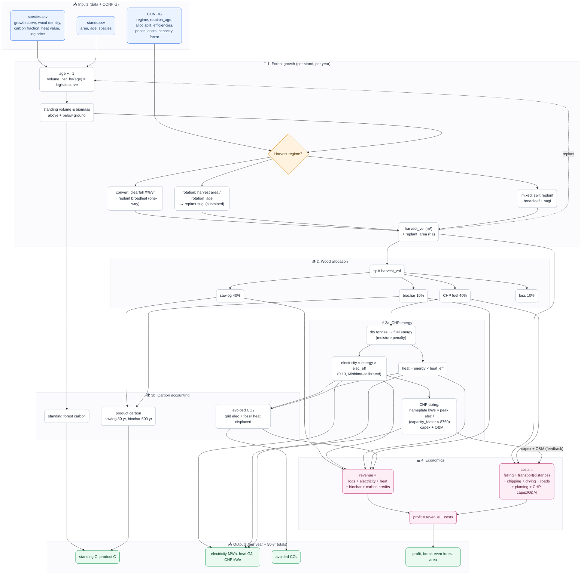

<!-- Version: v1.1 | Last modified: 2026-07-19 -->

# Forest Twin — model interaction diagram

How the variables flow through the simulator, one year at a time. Inputs (blue)
→ the three loops (forest / energy+carbon / money, pink) → outputs (green). The
CHP is **auto-sized** from the fuel flow, so capex/O&M feed back into the economics.

## The one-line story

`species + stands + CONFIG` → grow the forest → harvest it (the **regime**
decides if fuel is sustainable) → split the wood → burn some for **power + heat**
and lock the rest as **stored carbon** → tally **avoided CO₂** → subtract real
supply-chain **costs** (sized to a right-fit CHP) → **profit** and the
**forest-area needed** for a given CHP size.

The single most important link is the dotted **replant → grow** arrow: in
*rotation* mode it closes the loop (perpetual fuel); in *convert* mode it doesn't
(broadleaf is never re-harvested → fuel runs out).
