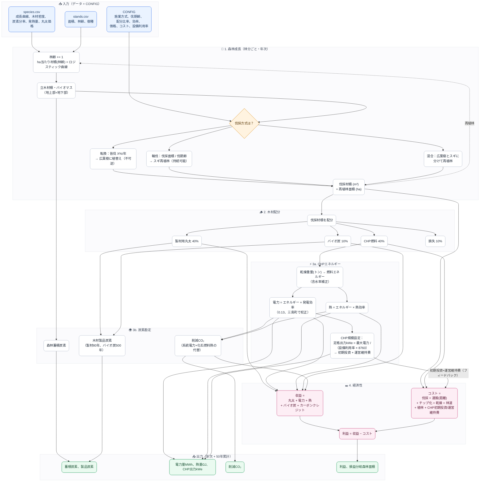

<!-- Version: v1.1 | Last modified: 2026-07-19 -->

# フォレストツイン — モデル相互作用図

シミュレーターの中で変数がどのように年次で流れるかを示す。入力（青）→ 3つのループ（森林／エネルギー・炭素／お金、ピンク）
→ 出力（緑）。CHPは燃料フローに応じて**自動サイジング**されるため、初期投資・運営維持費が経済性にフィードバックされる。

## 一行でいうと

`species + stands + CONFIG` → 森林を成長させる → 伐採する（**施業方式**が燃料の持続可能性を左右する）→ 木材を配分する →
一部を燃焼して**電力+熱**にし、残りを**貯蔵炭素**として固定する → **削減CO₂**を集計する → 実際のサプライチェーン**コスト**
（最適サイズのCHPに合わせた）を差し引く → **利益**と、所定のCHP規模に必要な**森林面積**を求める。

最も重要なリンクは点線の**再植林 → 成長**の矢印である：*輪伐*モードではループが閉じ（燃料は永続的）、*転換*モードでは
閉じない（広葉樹は再伐採されないため、燃料はいずれ枯渇する）。
