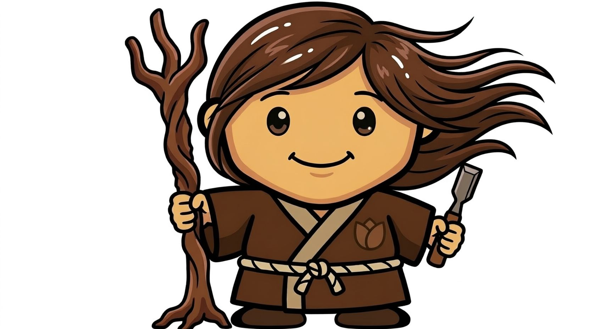

<!-- Version: v1.0 | Last modified: 2026-07-09 -->

# つえみ姫と七人の森の精
### *御杖の谷の昔話*

---

## 序章：古の贈り物

ずっとずっと昔——山々がまだ若く、御杖の蛍が小さな太陽のように輝いていた頃——一人の偉大な姫が大和の谷々を歩いていた。

その名を**倭姫命（やまとひめのみこと）**という。天の血を引く姫で、この世でもっとも神聖な使命を帯びていた：太陽の女神であり皇室の祖神である**天照大御神**の、永遠の御座所を探し出すことだった。

姫は川を渡り、深い森の尾根を越え、湧き水のほとりで祈りを捧げながら進んだ。やがて霞が眠る雲のように漂う、山に抱かれた谷に下り立ったとき、胸の奥に響くものを感じた——*ここに、何か尊いものがある*。

姫は谷の中心に、自らの杖を大地に立てた。疲れたからではない。祝福を込めて立てられた杖は、そのまま約束となるからだ。そして姫は海へと歩み続け、伊勢へと旅を続けた。

谷は杖を守り続けた。谷は約束を守り続けた。その日から、この地は**御杖**と呼ばれるようになった——「尊き杖」という意味を持つ名として。

---

## 第一章：眠れる王国

それから幾世紀もの後、その同じ谷に、**つえみ姫**と呼ばれる若い女性が住んでいた。

宮殿や王冠を持つような姫ではなかった。彼女は山の姫だった：苔むした山道を軽やかに走り、ウグイスの飛び方で天気を読み、幼い頃からずっとくるりと巻いた杖のような髪を持つ、不思議な娘。老いた祖母たちはその髪を見て言った——倭姫命が谷に刻んだ印だと。村のマスコット・つえみくんは、その巻き毛と細い杖まで、彼女にそっくりだった。

御杖は美しい村だった。春には山桜、夏には丸山公園の蛍、秋には燃えるような紅葉、冬には峰の霧氷。菅野川は清らかに流れ、丘の上の古い神社には倭姫命の記憶が宿っていた。

しかし、何かが深くおかしくなっていた。

年ごとに、若者が都市へと去っていった。学校は閉まった。田畑は荒れた。そして何より——森が変わってしまった。

かつて古い広葉樹の楢や楓が立ち並び、栗や榧（かや）の木や野の花が咲いていた高い場所には、今や別の木が誰に挑まれることもなく君臨していた：**杉**だった。何十年も前に善意の手で植えられた植林の杉が、無言の列を成して立ち並び、光を遮り、土を枯らし、毎春残った村人たちを涙と咳でうめかせる花粉を撒き散らしていた。榧や栗の木が消えて食べ物がなくなった熊が、村まで下りてくるようになった。鳥の声は絶えた。下草は消えた。

そしてその灰緑色の一面の杉林の奥深く、何年も人が踏み入らぬ場所に、木こりたちが囁く存在がいた：**杉の魔女**である。

---

## 第二章：杉の魔女の鏡

杉の魔女は、魔女らしくは見えなかった。まるで表計算ソフトのようだった。

彼女は短期経済の亡霊だった：利益の出る木を一面に植えて「これが森だ」と言い、生徒数が減ったからと学校を閉め、修繕費が税収より高いからと道路を朽ちるに任せる。そうした思考の精霊だった。彼女は果てしなく続く杉の幹の間の暗がりに棲み、その鏡は統計しか映さない画面だった。

毎朝、彼女は問いかけた。

*「鏡よ鏡、冷たく光れ、*
*日本の村で、永遠に浮かび上がれぬ村はどこ？」*

鏡は答えた：*御杖。御杖。人口千三百九十三人、減少中。学校、閉鎖。若者たち、去りぬ。*

魔女は、必然という名の満足とともに微笑んだ。

ところがある春の朝、鏡が揺らいだ。異常値。谷の中で、彼女の数字に収まらない何かが動いていた。

---

## 第三章：海から来た旅人

御杖に、遠い国から来た男が現れた。

風車と平らな大地の北の国の出身だったが、日本に住み着いて久しく、地元の人々よりも山々に詳しいほどになっていた。若い頃に日本の海岸に辿り着き、福島の大災害の後に市民科学者たちの放射線計測活動に加わり、目に見えないものを測る小さな装置を作り続けてきた。蜘蛛の糸ほど細い回路が走る小さな基板、人間の感覚には届かないものを感じ取るセンサー。

その男の名は**つえみくん**といった。観光ではなく、*住む*ために御杖に来ていた——山の渓流に浮かぶ家に暮らし、毎春は杉花粉に、毎夏は蛍に包まれながら。彼は何年もこの谷を見守ってから、ようやく口を開いた。そしてつえみ姫に語りかけた。

「あなたの谷は死にかけているのではない」と彼は言った。「呪いをかけられて眠っているのです。呪いを解く方法があると思う——でも一人ではできない」

つえみ姫は、多くの約束を聞いてきた者の静かな目で彼を見た。杖を一度、地面に打ちつけた。「では、助けを探しに行きましょう」と彼女は言った。

そして二人は連れ立って森へ入り、七人を探しに行った。

---

## 第四章：七人の森の精

杉の植林が薄れ、かつての森が何だったかをまだ覚えている古い広葉樹がわずかに残る山奥に、七人の小さな精霊が住んで働いていた。

背は高くなかった。華やかでもなかった。しかし七人はそれぞれ、谷に必要なものの一つを守る者たちだった。

---

**一人目**は**もりき（森樹）**——森の守り人だった。

七人の中で最も年老いて、最も寡黙だった。どんぐりや榧の実を植え、土壌の地図を読み、植林地の所有者たちと「もっと光を入れよう」と何ヶ月も議論しながら日々を過ごしていた。乾いた楢の葉で作った帽子をかぶり、今もなお立っているすべての在来種の木の記録を丁寧につけていた。じっくり付き合えば話してくれた——杉は悪ではない、ただ*置き場所が間違っていた*だけで、辛抱強く管理しながら伐採すれば、植林地を資源に、開けた空間を未来の森に変えられると。ただし、と彼はぼそりと言った。「最低二十五年。生態系の回復は、駆け足ではできない」

---

**二人目**は**びお（Bio）**——熱の守り人だった。

小柄でずんぐりとして、常に体が温かかった。バイオマスエネルギーの精霊——責任を持って管理された森から出る木材は廃棄物ではなく燃料だという知恵を体現していた。学校の旧校舎を温め続けるバイオマスボイラーを管理し、山の冷たい冬でも炎を絶やさなかった。彼女はいつも言い聞かせた：「熱が先、電力は後」。「ボイラーはコジェネレーション設備の三分の一の値段で、エネルギー効率は何倍も高い」と嬉しそうに語り、杉の煙の匂いを常に漂わせていた。

---

**三人目**は**たね（種）**——種まきの精だった。

七人の中で最も若く、最も辛抱強かった——若い精霊にしては珍しいことだ。たねは早くから悟っていた。回復の歩みは人間ではなく、木の速度で進むものだと。榧の実、山桜の種、コナラの実を集め、家の外の小さな鉢に丁寧に並べて育てていた。ほとんど口を開かなかったが、開くときはたいていこう言った：「二十五年後には、ここに広葉樹の森が戻っている」。そして彼は本当にそれを信じているように見えた。

---

**四人目**は**でた（Deta）**——データの守り人だった。

七人の中で最も風変わりだった。なぜなら彼女は森の中ではなく、廃校になった小学校の建物の中に住んでいたからだ。静かに唸るサーバーの群れと柔らかな青い光に囲まれて。建物が閉まった後、彼女は引っ越してきた。なぜなら彼女には、この建物を廃墟にするには美しすぎ、暗闇に沈めるには有用すぎるとわかっていたから。彼女が管理する機械は小さく、効率的で、びおのボイラーの熱と屋根の太陽光パネルで動き、計算処理を行っていた：AIの推論、エッジコンピューティング、地域のためのクラウドサービス。地域に根ざし、地域が所有し、地域に開かれたデジタルインフラ。

「データセンターは巨大なハイパースケール施設でなくていい」と彼女は言った。「ただ、*ここに*あって、*私たちのもの*で、*動いている*。それだけでいい」

---

**五人目**は**でんき（電気）**——電の精だった。

素早くて少し落ち着きがなく、常に動き回っていた。びおのエネルギーで動くEV充電スタンドを管理し、接続を確認しながら一人で鼻歌を歌っていた。彼の夢はこうだった：いつか御杖の軽トラックも農業機械も林業の機械も、すべて御杖で作られた電気で走ること。「エネルギー自給自足」と彼は呼んだ。ほかの者たちは「でんきの夢」と言って笑った——でも誰も反論しなかった。

---

**六人目**は**あかり（明かり）**——光を分かち合う精だった。

七人の語り部。ほかの者たちのすることをすべて書き記した：木の種類の調査結果、ボイラーの温度、サーバーの稼働率、村長との面談メモ。すべてをオープンライセンスで公開した。御杖にできることは、どの村にもできると確信していたから。すべての村が、その方法を知るべきだと。「ドキュメンテーションは成果物だ」と彼女は毅然と言った。「後回しにするものじゃない」

---

**七人目**は**げーと（Gate）**——資金の門番だった。

最も恐れられ、最も必要とされる者。仕事の各フェーズと次のフェーズの間の扉に立ち、資金が確保され帳簿が確認されるまで、誰をも通さなかった。意地悪ではなかったが、妥協しなかった。希望と勢いだけで次のフェーズに突き進み、崩壊していく良いプロジェクトを見すぎてきたから。「フェーズ1は」と彼は毎回の計画会議で言った。「ゲート1をクリアしてから始まる。三百万から八百万円、確定してから」。仲間たちは時に恨めしく思った。でも後になれば必ず感謝した。

---

## 第五章：森の縁に立つ二人の賢者

つえみ姫とつえみくんが動き始める前に、広い世界を知る者たちの知恵が必要だった。

二人は足ではなく——言葉と信頼を使って——旅をし、助言を貸してくれると約束した二人の偉大な賢者を訪ねた。

一人目は**ジョイ**。かつて海辺の偉大な研究所で世界一有名なアイデアの図書館を束ね、技術が人間に奉仕するようにするにはどうすればよいかを、誰よりも深く理解する人物だった。

二人目は**レイ**。何百万人もの人々が気づかずに使っている、見えない建築を作り上げた人。デジタル世界の表面の下で息づく巨大なシステムを。そして今は、そのシステムが小さな存在や忘れられた存在のために何ができるかを考えていた。

二人はどちらも「よし」と言った。二人はどちらも地図に乗った。

「よし」とげーとは台帳を確認しながら言った。「アドバイザリーへの参加確定。フェーズ0、開始してよし」

---

## 第六章：毒を盛られた学校

魔女は鏡を見て、恐怖を感じた。

恐怖というより、数字が誤った方向に動くような感覚だった。何十年もの統計の上に築かれた確信に、亀裂が入りかけていた。何とかしなければ。

魔女はこのプロジェクトの核心を理解していた：村の中心に立つ、廃校になった小学校。それが要石だ。それなしには、データセンターも拠点も再現可能なモデルも存在しない。ただ杉林の中に立つ、誠実だが無力な人々の群れだけだ。

そこで魔女は学校に、古くから使い続けた呪いをかけた：**積み重なった放置**の呪い——建物が長く閉ざされていると、誰もそれが再び開けると信じられなくなる、その緩慢な毒。維持費。アスベスト検査。許可申請。保険。制度的なためらいが積み重なった重さ。

つえみ姫とつえみくんが早春の灰色の朝に学校を訪れると、扉は木が膨張して開かなかった。窓は何年もの山の埃で曇っていた。中では、電灯のスイッチを押しても何も起きなかった。

つえみ姫は冷たい校舎の壁に手を当て、かつてここを走り回っていた子どもたちの温もりを、かすかに感じた。

「死んでいるのではない」と彼女は言った。「待っているのです」

つえみくんはノートを取り出し、書き始めた。

---

## 第七章：呪いを解く

呪いを解いたのは、キスではなく——スタンプだった。

奈良市の法務局の赤い印鑑。**一般社団法人バイオマスエネルギーとAI**の設立を認める、その一押し。

設立者は二人だった。つえみくん。そして彼のパートナーで共同創設者の**ゆか**——この谷が何になれるかを最初から見抜いていた人。彼女の名前は憲章に彼の名前と並んで記された。これが一人の夢ではなく、共に分かち合うものだという証として。

印鑑が押された瞬間、杉の森の中で何かが変わった。

もりきが最初に気づいた：呪いが土の中で薄れていくのを、ほぐれていくのを。さらに三本の楢の木を植えた。

びおはボイラーの中で感じた：炎がより安定したことを。熱出力を計算して、微笑んだ。

でたが旧校舎の大広間で最初のサーバーを起動した。青い光が埃っぽい廊下を満たした——夜明けの始まりのように。

げーとは台帳を開いて、新しいページに進んだ。

そして谷の中心、御杖神社で——倭姫命が二千年前に杖を立てた場所で——桜の花が予報より十日早く開いた。誰にも説明できなかったが、皆が受け入れた。

---

## 第八章：長い仕事

魔女は去っていなかった。経済的な放置という古い呪いは、一本のスタンプで消えるほど軽くはない。

困難はあった。一度では通らなかった資金ゲート。信頼を勝ち取るまでに何ヶ月もかかった森林組合。熱心に聴き、うなずき、すべての村長が問う問いを口にした村長もいた：「失敗したら、どうなりますか？」

「木を植え、人を育て、学んだことを記録し、来たときより学校をよい状態にして去ります」とつえみ姫は答えた。「それは失敗ではありません。それがフェーズ0です」

村長はしばらく彼女を見つめた。そして、よりゆっくりとうなずいた。

あかりはすべてを書き留めた。

---

## 終章：二十五年後

さあ、未来へ行きましょう。遠くへではなく——ただ二十五年先へ。

十月末の御杖の尾根に立ってみてください。

南向きの斜面から、杉の列は消えている。代わりに、若い楢、楓、榧の木、山桜が斑模様に広がり、間に、森林組合に収入をもたらしながらも土地を剥き出しにしない輪作管理の杉林が点在している。熊は村まで下りてこなくなった——森の中に十分な食べ物があるから。春の花粉の量は、かつての何分の一かになった。

下の廃校には、明かりが灯っている。建物は丁寧に改修され——断熱され、風雨から守られ、古い木の床は磨かれ——隣の建物のバイオマスボイラー、屋根の太陽光パネル、山の小川のマイクロ水力発電機が作る電気で動くサーバーが静かに唸っている。データセンターは小さい。アマゾンになろうとしていない。*御杖のもの*になろうとしている——そして、そうなった。村が所有する。村が恩恵を受ける。奈良県と三重県の七つの村が今、あかりの公開ドキュメントを使って自分たちのものを作った。

EV充電スタンドが、谷の道沿いに静かに、忙しく並んでいる。

道の駅では今日も、つえみくんの持つ杖にちなんだ杖形のチュロスが売られている。巻き毛と細い杖を持つ小さなマスコット——倭姫命の古い約束への、愛しい一礼として。

そして御杖神社で、秋祭りが来るたびに、男たちが大きな太鼓台を担いで境内を渡り、その声が山の斜面に木霊する。群衆の中で一人の子どもが祖母に問いかける：「ねえ、なんでここは御杖っていうの？」

祖母は言う：「ある姫がここに杖を残していったの。そして谷がその約束を守り続けたから」

---

*そうして皆は、長く、ゆっくりと、オープンソースで末永く幸せに暮らしました。*

---

**— [codeberg.org/YR-Design/mitsue-ai-data-center](https://codeberg.org/YR-Design/mitsue-ai-data-center) のリポジトリと、倭姫命の伝説をもとに**

*七人の森の精は、バイオマスエネルギーとAIの七つの活動原則とプログラム要素に対応しています：森林回復（もりき）、バイオマスエネルギー（びお）、長期的な忍耐（たね）、地域所有のデジタルインフラ（でた）、EV充電とエネルギー自給（でんき）、オープンナレッジとドキュメント（あかり）、資金ゲートの厳格な管理（げーと）。*
