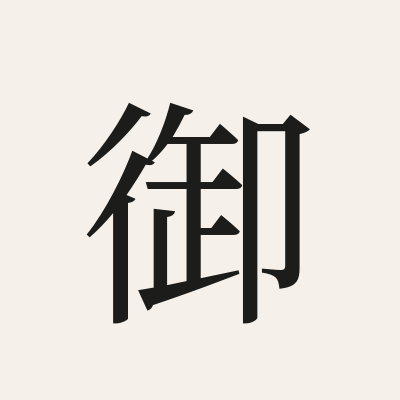

<div style="font-family:-apple-system,Helvetica,Arial,sans-serif;">
<p style="font-size:7.5pt; font-weight:600; letter-spacing:0.25em; color:#3a7a5a; margin:0 0 4mm;">PROJECT DOCUMENT</p>
<h1 style="font-size:28pt; font-weight:700; margin:0 0 2mm; border-bottom:1px solid #eee; padding-bottom:2mm;">Mitsue Project</h1>
<p style="font-style:italic; color:#666; margin:2mm 0 8mm;">SIIF System Change Pitch</p>
<p style="font-style:italic; text-align:center; color:#3a7a5a; margin:4mm 0;">"The forest our ancestors planted — the power that sustains the village they built"<br><span style="font-size:0.9em;">先人が植えた森が、今、村を支える力になる。</span></p>

<div style="height:105mm;"></div>
<table style="width:100%; border-collapse:collapse; font-size:9pt;">
<tr><td style="padding:3mm 4mm; border:1px solid #ccc; font-weight:bold; width:30%;">Version</td><td style="padding:3mm 4mm; border:1px solid #ccc;">v1.0</td></tr>
<tr><td style="padding:3mm 4mm; border:1px solid #ccc; font-weight:bold;">Date</td><td style="padding:3mm 4mm; border:1px solid #ccc;">2026-06-14</td></tr>
<tr><td style="padding:3mm 4mm; border:1px solid #ccc; font-weight:bold;">Author</td><td style="padding:3mm 4mm; border:1px solid #ccc;">Rob Oudendijk</td></tr>
</table>
</div>

<div style="page-break-after:always; break-after:page; height:0; margin:0; padding:0;"></div>

---

# SIIF System Change Pitch

*For: Yuya Kato, Impact Officer, SIIF — Morgan Lewis Event, July 2026*

---

## English

### The structural problem

Japan planted 4.4 million hectares of sugi (cedar) monoculture after WWII. Cheap imported timber made domestic forestry unviable. The result: abandoned plantations that block sunlight, kill understorey biodiversity, increase flood and landslide risk, and anchor the rural population decline that is emptying villages like Mitsue. This is not a local problem — it is a national structural failure repeated across thousands of mountain communities.

### The system we are building

Mitsue village is designing a self-reinforcing circular system that turns the structural problem into the solution engine:

```
Sugi thinning → biomass fuel → CHP electricity (24/7 baseload)
     ↓                                      ↓
Native forest regrowth            AI data center + village grid
     ↓                                      ↓
Ecological restoration          Revenue → more forestry + community services
```

Every node feeds the next. The faster the forest is thinned, the more power is generated; the more power, the more data center revenue; the more revenue, the more forestry. This is not a project — it is a system change.

The village currently suffers from blackouts. The microgrid (biomass CHP + solar + battery) solves this as a direct co-benefit, alongside four public EV charging stations that make the village viable for the next generation.

### Why this is System Change, not a project

| Symptom (surface) | Structural root cause | Our intervention |
|---|---|---|
| Village depopulation | No economic base, no services | Data center jobs + energy revenue |
| Blackouts | Grid dependency, no local generation | Biomass CHP microgrid |
| Forest degradation | Market failure in domestic forestry | CHP creates demand for thinnings |
| CO₂ emissions | No circular biomass economy | Closed-loop forestry-to-energy cycle |

### What we need from SIIF

1. **Impact measurement framework** — Help us define the KPIs (CO₂ avoided, hectares restored, energy independence %, jobs created) in a format credible to MoE grant assessors and institutional investors.
2. **Catalytic capital or grant introduction** — ¥28M–¥53M funding gap remains. Outcome-based financing or a SIIF catalytic grant could unlock the full ¥245M project.
3. **Network introduction** — Regional social impact fund connections or government outcome-fund pathways you are already working with.

### Project snapshot
- **Location:** 御杖村, Nara Prefecture
- **Budget:** ¥245M total | ¥192M committed | ¥28M–¥53M gap
- **Legal entity:** 一般社団法人 (being established; public-interest designation planned)
- **Timeline:** 30 months, Phase 3 completion Sep 2028
- **Primary energy:** Biomass CHP from sugi thinnings (solar + battery + EV charging complementary)

**Contact:** Rob Oudendijk — oudendijk.biz@gmail.com

---

## 日本語

### 構造的な問題

戦後、日本は440万ヘクタールのスギ人工林を造林しました。しかし安価な輸入材により国内林業は採算が取れなくなり、森は放置されました。その結果、光が遮断され林床の生物多様性は失われ、洪水・土砂災害リスクが高まり、御杖村のような山村の過疎化が加速しています。これは地域の問題ではなく、全国数千の山村で繰り返されている構造的な失敗です。

### 私たちが構築するシステム

御杖村は、構造的問題そのものを解決エンジンに変える自己強化型の循環システムを設計しています。

```
スギ間伐 → バイオマス燃料 → CHP電力（24時間安定供給）
   ↓                              ↓
在来樹林の再生            AIデータセンター＋村の電力網
   ↓                              ↓
生態系の回復          収益 → さらなる林業・地域サービスへ
```

各要素が次を支えます。間伐が進むほど発電量が増え、発電が増えるほどデータセンター収益が増え、収益が増えるほど林業が進む。これはプロジェクトではなく、システム・チェンジです。

村では現在、停電が発生しています。バイオマスCHP＋太陽光＋蓄電池によるマイクログリッドはこれを直接解決し、4基のEV充電ステーションが次世代の村を支えます。

### なぜこれがシステム・チェンジなのか

| 表面的な症状 | 構造的な根本原因 | 私たちの介入 |
|---|---|---|
| 過疎化・人口流出 | 経済基盤なし・サービスなし | データセンター雇用＋エネルギー収益 |
| 停電 | 系統依存・地産電力なし | バイオマスCHPマイクログリッド |
| 森林荒廃 | 国内林業の市場失敗 | CHPが間伐材需要を創出 |
| CO₂排出 | 循環型バイオマス経済の欠如 | 林業〜エネルギーの閉ループ |

### SIIFに期待すること

1. **インパクト測定フレームワーク** — CO₂削減量、森林再生面積、エネルギー自給率、雇用創出数など、環境省交付金審査と機関投資家の両方に通用するKPI設計の支援。
2. **触媒的資本または補助金の紹介** — 2,800万〜5,300万円の資金ギャップが残っています。アウトカム・ベースの資金調達またはSIIFの触媒的グラントにより、総事業費2億4,500万円のプロジェクト全体が動き出します。
3. **ネットワーク紹介** — SIIFがすでに連携している地域インパクトファンドや政府アウトカムファンドへのご紹介。

### プロジェクト概要
- **所在地：** 奈良県御杖村
- **予算：** 総額2億4,500万円 | 調達済み1億9,200万円 | ギャップ2,800万〜5,300万円
- **法人格：** 一般社団法人（設立中、公益認定申請予定）
- **スケジュール：** 30ヶ月、Phase 3完了 2028年9月
- **主要エネルギー：** スギ間伐材によるバイオマスCHP（太陽光・蓄電池・EV充電設備が補完）

**連絡先：** Rob Oudendijk — oudendijk.biz@gmail.com
