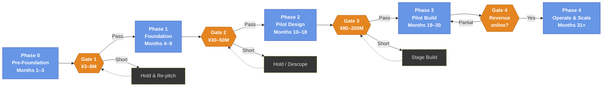

Version: v1.1 &nbsp;|&nbsp; Last modified: 2026-05-09

# Mitsue Project — 御杖プロジェクト

**A 25-Year Initiative for Forest Restoration, Distributed Renewable Energy, and Community-Owned Digital Infrastructure in Rural Japan.**

| | |
|---|---|
| **Location** | Mitsue Village, Nara Prefecture, Japan |
| **Initiated** | April 2026 |
| **Horizon** | 25 years |
| **Current Phase** | Phase 0 — Pre-Foundation (Months 1–3) |
| **Project Lead** | Rob Oudendijk (YR-Design / Safecast) |
| **Document Status** | Working draft, May 9, 2026 |

---

## 1. Executive Summary

The Mitsue Project is a non-profit initiative to repurpose the closed Mitsue Elementary School and the surrounding forested landscape into an integrated demonstration of rural revitalization. The project combines three mutually reinforcing activities — native forest restoration, locally generated biomass and renewable energy, and a small-scale community-owned data center — under a single coordinating organization.

The project is designed to be **modest in scale, fully transparent, and openly replicable**, so that other depopulating municipalities in Japan and beyond can adapt the model to their own circumstances. The 25-year horizon is intentional: it bridges the period between today's rural energy and digital deficits and the anticipated availability of localized small-scale fusion power generation.

---

## 2. Mission and Vision

**Mission.** To demonstrate that rural Japanese communities can build their own sustainable future by integrating ecological restoration, locally generated clean energy, and modern digital infrastructure — and to share what is learned so that other communities may follow.

**Vision (2050).** Mitsue Village is a self-sustaining model of rural revitalization in which restored native forests, locally generated biomass and renewable energy, and a small-scale community-owned data center together support the village's economy, ecology, and digital future. The model is openly documented and freely available to any community that wishes to adapt it.

---

## 3. Strategic Rationale

- **Energy transition.** Within roughly ten years, the majority of Japanese passenger vehicles are expected to be electric. This transition will require significant new distributed generation capacity, particularly in rural regions where grid extension is slow and capital-intensive.
- **Forest liability conversion.** Aged sugi (cedar) plantations across rural Japan represent an under-managed asset that imposes ecological costs (pollen burden, biodiversity loss) and physical risks (landslide and fire). Active management converts liability into feedstock and timber revenue.
- **Stranded community assets.** Closed schools, such as the former Mitsue Elementary School, currently impose net maintenance costs on shrinking municipal budgets. Productive reuse turns these into community-anchored facilities.
- **Digital infrastructure deficit.** Rural broadband and edge-compute capacity continue to lag urban Japan. A small, energy-aligned data center addresses both the connectivity and the on-site computation gap.

---

## 4. Programme Components

### 4.1 Forest Restoration
Phased replacement of aged sugi plantations with native broadleaf species, in cooperation with private landowners, the Forestry Agency (林野庁), and local forestry contractors. Restoration operates on a 25-year ecological timeline.

### 4.2 Sustainable Energy Generation
Biomass and biogas generation from sustainably harvested forest material. Output is intended for local consumption (village load, EV charging, heat for greenhouses or community use) with grid feed-in via FIT/FIP where economically appropriate.

> **Thermal first, electrical second.** At pilot scale, a biomass boiler with heat recovery costs roughly one-third as much as a combined heat-and-power unit and is several times more energy-efficient. The project therefore begins with thermal output and adds electrical generation only when feasibility, demand, and feedstock economics support it. The aim is **not** to replace the village's existing solar capacity or to power Mitsue from biomass alone — the realistic local mix is biomass (baseload and heat) + existing solar (daytime) + the grid (backup).

### 4.3 Community-Owned Data Center
Repurposing of the closed Mitsue Elementary School building as a small-scale, energy-efficient edge-compute facility, powered entirely by locally generated renewable energy. The facility is sized for accountability and community ownership, not for hyperscale economics.

### 4.4 EV Charging Network
Provision of distributed charging infrastructure for residents and visitors, anchored to local generation rather than dependent on external grid extension.

### 4.5 Education and Open Knowledge
All methods, data, financial records, and lessons learned are published under open licences so that other communities may replicate or adapt the model.

---

## 5. Phased Implementation

The first three years are organised into five phases, each gated by an explicit funding checkpoint. The full phase logic, including hold/descope branches and the funding-source map, is documented in [`mitsue_phases_funding_flowchart.md`](mitsue_phases_funding_flowchart.md).

| Phase | Months | Focus | Indicative Budget |
|-------|--------|-------|-------------------|
| 0. Pre-Foundation | 1–3 | Local trust-building, founding team, draft charter | ¥0–0.5M (self-funded) |
| 1. Foundation | 4–9 | Legal entity, feasibility studies, professional advisors | ¥3–8M |
| 2. Pilot Design | 10–18 | Detailed engineering, partnerships, permits | ¥15–30M |
| 3. Pilot Build | 19–30 | First-stage construction, commissioning | ¥80–200M |
| 4. Operation & Scale | 31+ | Operations, monitoring, replication | Variable |

Funding gates between phases are: **G1 ¥3–8M · G2 ¥30–50M · G3 ¥80–200M · G4 Operating revenue online**. Failure to clear a gate triggers a hold-and-re-pitch cycle rather than acceleration into an under-resourced phase.

A more detailed plan, including phase-by-phase deliverables, ROI framework, and risk register, is in [`mitsue_implementation_plan.md`](mitsue_implementation_plan.md).

---

## 6. Current Status — Phase 0

**Period:** Months 1–3 · **Budget:** Self-funded · **Posture:** No public announcements, no press, no website.

### Completed
- Initial meeting with Vice Mayor of Mitsue (late 2025)
- Initial meeting with the local forestry group (early 2026)
- Drafted founding charter and detailed implementation plan (April 2026)
- Phase and funding-gate flowchart published (May 2026)
- Advisory commitments confirmed: Joi Ito and Ray Ozzie (confirmed May 5, 2026)
- Draft project overview prepared for the Dutch Consul General

### In Progress
- Identifying a Japanese co-founder with rural credibility (top priority)
- Scheduling a formal meeting with the Village Mayor
- Drafting bylaws for a 一般社団法人 (General Incorporated Association)
- Engaging a 行政書士 (administrative scrivener) in Nara
- Confirming letter-of-support from the Dutch Consul General (Sandra Pellegrom)

### Next 30 Days
1. Approach candidate Japanese co-founder
2. Hold informal meeting with the Village Mayor
3. Initial consultations with one or two administrative scriveners
4. Finalise a two-page bilingual charter for distribution
5. Send formal letter requesting name support from Consul General Pellegrom

A live working list is maintained in [`mitsue_todo.xlsx`](mitsue_todo.xlsx) (PDF copies in English and Japanese available in the repository).

---

## 7. Governance

### Founding Members
- Rob Oudendijk — YR-Design / Safecast
- Japanese Co-founder — to be confirmed
- Additional founding members — to be confirmed (target: 3–5 total)

### Advisory Board
- **Joi Ito** — former Director, MIT Media Lab
- **Ray Ozzie** — software pioneer; former Microsoft Chief Software Architect

### Legal Structure
- **Today:** Pre-incorporation
- **First 6–9 months:** Incorporation as a 一般社団法人 (General Incorporated Association)
- **Months 18–24:** Planned conversion to NPO法人 (Specified Nonprofit Corporation) for greater grant access
- **Long-term:** Pursue 認定NPO法人 (Certified NPO) status for tax-deductible donations

### Founding Documents
- [`mitsue_founding_charter.md`](mitsue_founding_charter.md) — bilingual (EN/JP) founding charter
- [`mitsue_founder_agreement_template.md`](mitsue_founder_agreement_template.md) — founder alignment template

---

## 8. Funding Strategy

The project pursues a five-layer funding stack, with each layer unlocked by the deliverables of the prior phase. This staged structure protects against early dependence on any single source.

| Layer | Source | Year 1 Target | Year 3 Target |
|-------|--------|---------------|---------------|
| L1 | Founder / private capital | ¥3M | ¥1M |
| L2 | Government grants (NEDO, METI, Nara Prefecture, Mitsue village) | ¥5M | ¥80M |
| L3 | Foundations (Nippon Foundation, Japan Fund for Global Environment, Toyota Foundation, others) | ¥3M | ¥20M |
| L4 | Corporate partnerships (Dutch and Japanese; CSR-aligned) | ¥0 | ¥30M |
| L5 | Operating revenue (hosting fees, FIT/FIP, heat, EV charging, J-Credits) | ¥0 | ¥3M |
| **Total (illustrative)** | | **¥11M** | **¥134M** |

These figures are planning targets, not commitments. Actual funding mix will depend on grant outcomes and partnership negotiations during Phases 1 and 2.

---

## 9. Operating Principles

1. **Local first.** Every material decision begins with the wellbeing of Mitsue residents and landowners.
2. **Open and transparent.** Environmental data, financial records, and methodologies are published.
3. **Patient and long-term.** A 25-year horizon; no premature scaling.
4. **Replicable.** Documentation discipline is treated as a deliverable, not an afterthought.
5. **Modest in scale.** Small enough to remain accountable to the community.
6. **Non-partisan.** No political alignment; positions are confined to the project's mission.

---

## 10. Repository Contents

This repository holds the working documents that govern the project's first three years. Key files:

| File | Purpose |
|------|---------|
| `README.md` | This document |
| `mitsue_founding_charter.md` / `.pdf` | Bilingual founding charter (EN/JP) |
| `mitsue_implementation_plan.md` / `.pdf` | Detailed five-phase implementation plan (EN) |
| `mitsue_implementation_plan_jp.md` / `.pdf` | Japanese translation of the implementation plan |
| `mitsue_phases_funding_flowchart.md` / `.pdf` | Phase spine and funding-gate diagrams |
| `mitsue_project_overview_pellegrom.md` / `.pdf` | Stakeholder overview prepared for the Dutch Consul General |
| `mitsue_village_government_onepager.md` / `.pdf` | One-page brief for village government engagement |
| `mitsue_village_government_onepager_jp.md` / `.pdf` | Japanese version of the village government brief |
| `mitsue_mayor_meeting_talking_points.md` / `.docx` | Preparation document for the formal mayor meeting |
| `mitsue_qa_briefing.md` | Bilingual Q&A briefing addressing six common questions on biomass, data center, solar, and 25-year horizon |
| `mitsue_founder_agreement_template.md` / `.pdf` | Founder alignment template |
| `mitsue_letter_pellegrom_support_request.md` | Draft letter requesting consular goodwill association |
| `mitsue_project_founding_story.md` / `.pdf` | Narrative founding-story document (EN) |
| `mitsue_project_founding_story_jp.md` / `.pdf` | Japanese version of the founding story |
| `mitsue_stakeholders.md` | Stakeholder entity list and relationship map (EN), with Mermaid diagram |
| `mitsue_stakeholders_jp.md` | Japanese version of the stakeholder list and relationship map |
| `mitsue_stakeholder_graph.html` | Interactive stakeholder relationship graph (EN) |
| `mitsue_stakeholder_graph_jp.html` | Interactive stakeholder relationship graph (JP) |
| `mitsue_todo.xlsx` / `.pdf` | Working task list (English and Japanese PDFs) |
| `mitsue_finance.xlsx` | Financial planning workbook |
| `OPENPROJECT.md` | OpenProject project management setup, API reference, and Codeberg document index |
| `openproject_docker-compose.yml` | Docker Compose configuration for the local OpenProject instance |
| `openproject_backup.sh` / `openproject_restore.sh` | Backup and restore scripts for OpenProject data |
| `openproject_backup.json` / `openproject_backup.sql` | Most recent OpenProject work-package export and PostgreSQL dump |
| `openproject_robouden_theme.css` | Custom dark theme for the OpenProject UI (applied via Stylus extension) |

Related working folders for forestry research, the closed-school site, and visual assets sit alongside this repository under the parent `Mitsue/` directory.

---

## 11. Contact

- **Project Lead:** Rob Oudendijk
- **Affiliations:** YR-Design · Safecast
- **Location:** Mitsue Village, Nara Prefecture, Japan
- **Public communications:** Not yet active; project remains in pre-foundation phase

Formal channels (website, dedicated email, NPO bank account) will be established at the start of Phase 1.

---

## 12. Licence and Open Data

All project documentation, environmental data, and methodologies will be released under permissive open licences (Creative Commons for documents; appropriate open licences for data and code) consistent with the project's open-knowledge commitment.

---

*Last updated: May 9, 2026 · Maintained by Rob Oudendijk*
