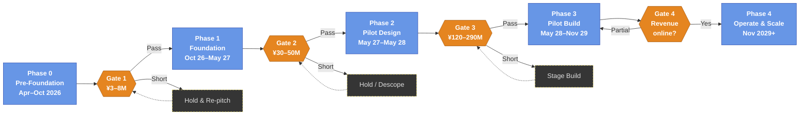

<!-- Version: v1.4 | Last modified: 2026-07-14 -->

# BIOMASS ENERGY & AI — バイオマスエネルギーとAI

### Reforesting in Mitsue — 御杖村における地域植林

**A 25-Year Initiative for Forest Restoration, Distributed Renewable Energy, and Community-Owned Digital Infrastructure in Rural Japan.**

> **"The forest our ancestors planted — the power that sustains the village they built"**
> 先人が植えた森が、今、村を支える力になる。

|                     |                                         |
| ------------------- | --------------------------------------- |
| **Location**        | Mitsue Village, Nara Prefecture, Japan  |
| **Initiated**       | April 2026                              |
| **Horizon**         | 25 years                                |
| **Current Phase**   | Phase 0 — Pre-Foundation (Apr–Oct 2026) |
| **Project Lead**    | Rob Oudendijk (YR-Design / Safecast)    |
| **Document Status** | Working draft, July 3, 2026             |

---

## 1. Executive Summary

The BIOMASS ENERGY & AI project is a non-profit initiative to repurpose available community facilities — the former Sugano Elementary School (Mitsue Taiken Koryukan), the leading candidate site, or a disused village factory building, the alternative candidate (final site confirmed in Phase 1) — together with the surrounding forested landscape, into an integrated demonstration of rural revitalization. The project combines three mutually reinforcing activities — native forest restoration, locally generated biomass CHP energy from sugi forest thinnings (complemented by solar, EV charging, and community backup power), and a small-scale community-owned data center — under a single coordinating organization.

The project is designed to be **modest in scale, fully transparent, and openly replicable**, so that other depopulating municipalities in Japan and beyond can adapt the model to their own circumstances. The 25-year horizon is intentional: it bridges the period between today's rural energy and digital deficits and the anticipated availability of localized small-scale fusion power generation.

---

## 2. Mission and Vision

**Mission.** To demonstrate that rural Japanese communities can build their own sustainable future by integrating ecological restoration, locally generated clean energy, and modern digital infrastructure — and to share what is learned so that other communities may follow.

**Vision (2050).** Mitsue Village is a self-sustaining model of rural revitalization in which restored native forests, locally generated biomass CHP energy from sugi thinnings, complementary solar and EV charging infrastructure, community backup power, and a small-scale community-owned data center together support the village's economy, ecology, and digital future. The model is openly documented and freely available to any community that wishes to adapt it.

---

## 3. Strategic Rationale

- **Energy transition.** Japan targets 100% electrified new passenger-vehicle sales by 2035 (EVs, PHEVs, FCVs, HEVs) — not pure-EV, but a deliberate mix. This transition will require significant new distributed generation and charging capacity, particularly in rural regions where grid extension is slow and capital-intensive. Japan's FY2024 CEV subsidy scheme (up to ¥850,000 for an EV, ¥550,000 for a PHEV or light EV) now also rewards charging infrastructure and disaster resilience.
- **Forest liability conversion.** Aged sugi (cedar) plantations across rural Japan represent an under-managed asset that imposes ecological costs (pollen burden, biodiversity loss) and physical risks (landslide and fire). Active management converts liability into feedstock and timber revenue.
- **Stranded community assets.** Available community facilities — the former Sugano Elementary School (Mitsue Taiken Koryukan) and disused village factory buildings — currently impose net maintenance costs on shrinking municipal budgets. Productive reuse turns these into community-anchored facilities.
- **Digital infrastructure deficit.** Rural broadband and edge-compute capacity continue to lag urban Japan. A small, energy-aligned data center addresses both the connectivity and the on-site computation gap.

### 3.1 Alignment with the Village's Renewable Energy Plan

In January 2025, Mitsue Village published its official **"Plan for Maximum Introduction of Renewable Energy"** (御杖村再エネ導入最大化計画), funded by a Ministry of the Environment grant and adopted as the village's statutory decarbonization strategy through 2050. The BIOMASS ENERGY & AI project is not proposing a competing idea — it is offering to be the **implementation and operating vehicle (官民連携 運営体制) for the plan the village has already written, funded, and committed to.** The project delivers the plan's explicit targets for a "one resilient distributed-energy site" within the village (currently zero), its priority for EV charging at public facilities (transport = 46% of emissions), its distributed disaster-resilience goals, and the forest-carbon/J-Credit mechanism the plan calls for but cannot deliver alone. Critically, the plan's completion under the MoE planning-support grant (step 1) makes Mitsue eligible for the **地域脱炭素移行・再エネ推進交付金** (step 2) — a 2/3–3/4 subsidy on solar/battery/EV/private-wire capex, paid to the municipality through public-private partnership. See [`mitsue_village_re_plan_alignment.md`](mitsue_village_re_plan_alignment.md) for the full analysis.

---

## 4. Programme Components

### 4.1 Forest Restoration

Phased replacement of aged sugi plantations with native broadleaf species, in cooperation with private landowners, the Forestry Agency (林野庁), and local forestry contractors. Restoration operates on a 25-year ecological timeline. Native broadleaf trees — oak, chestnut, and konara — produce acorns and nuts that sustain deer, wild boar, and bear through winter. When the forest feeds them, they stay in the forest, directly reducing wildlife raids on surrounding crop areas.

### 4.2 Biomass CHP Energy, Solar, EV Charging & Community Resilience

The village's primary energy source is a biomass combined heat and power (CHP) system fuelled by sugi forest thinnings, generating 24/7 baseload electricity (primary output) and heat (secondary output). This circular local energy economy — where the forest powers the village — is complemented by solar generation at the project site, EV charging stations for residents and visitors, and backup power for critical community facilities during grid outages. Unlike intermittent solar alone, biomass CHP supplies the round-the-clock baseload the data center needs. As Japan's vehicle fleet shifts to electric, local charging infrastructure becomes essential — particularly in rural areas where grid extension is slow. Battery storage will be evaluated during the Phase 1 feasibility study and installed only if confirmed.

### 4.3 Community-Owned Data Center

Repurposing of the former Sugano Elementary School (Mitsue Taiken Koryukan) — the leading candidate — or a disused village factory building (the alternative candidate; final site confirmed in Phase 1) as a small-scale, energy-efficient edge-compute facility, powered entirely by locally generated renewable energy. The facility is sized for accountability and community ownership, not for hyperscale economics. By integrating a community-owned AI data center with locally generated biomass CHP and solar power, native forest restoration, and EV charging infrastructure, Mitsue sets a working example of how rural communities can combine technological progress with ecological sustainability — not as opposites, but as a single coherent system built to be replicated.

### 4.4 EV Charging Network

Provision of distributed charging infrastructure for residents and visitors, anchored to local generation rather than dependent on external grid extension.

### 4.5 Education and Open Knowledge

All methods, data, financial records, and lessons learned are published under open licences so that other communities may replicate or adapt the model.

---

## 5. Phased Implementation

The first three years are organised into five phases, each gated by an explicit funding checkpoint. The full phase logic, including hold/descope branches and the funding-source map, is documented in [`mitsue_phases_funding_flowchart.md`](mitsue_phases_funding_flowchart.md).

```mermaid
flowchart LR
    P0["Phase 0<br/>Pre-Foundation<br/>Apr–Oct 2026"]
    P1["Phase 1<br/>Foundation<br/>Oct 26–May 27"]
    P2["Phase 2<br/>Pilot Design<br/>May 27–May 28"]
    P3["Phase 3<br/>Pilot Build<br/>May 28–Nov 29"]
    P4["Phase 4<br/>Operate & Scale<br/>Nov 2029+"]

    G1{{"Gate 1<br/>¥3–8M"}}
    G2{{"Gate 2<br/>¥30–50M"}}
    G3{{"Gate 3<br/>¥120–290M"}}
    G4{{"Gate 4<br/>Revenue<br/>online?"}}

    H1["Hold & Re-pitch"]
    H2["Hold / Descope"]
    H3["Stage Build"]

    P0 --> G1
    G1 -->|Pass| P1
    P1 --> G2
    G2 -->|Pass| P2
    P2 --> G3
    G3 -->|Pass| P3
    P3 --> G4
    G4 -->|Yes| P4

    G1 -->|Short| H1 -.-> G1
    G2 -->|Short| H2 -.-> G2
    G3 -->|Short| H3 -.-> G3
    G4 -->|Partial| P3

    classDef phase fill:#6796e6,stroke:#3655b5,stroke-width:1px,color:#FFFFFF,font-weight:bold
    classDef gate  fill:#e58520,stroke:#A85C10,stroke-width:1px,color:#FFFFFF,font-weight:bold
    classDef hold  fill:#353535,stroke:#FCEB6C,stroke-width:1px,color:#DEDEDE,stroke-dasharray:4 3
    class P0,P1,P2,P3,P4 phase
    class G1,G2,G3,G4 gate
    class H1,H2,H3 hold
```

| Phase                | Timeframe         | Focus                                                    | Indicative Budget     |
| -------------------- | ----------------- | -------------------------------------------------------- | --------------------- |
| 0. Pre-Foundation    | Apr–Oct 2026      | Local trust-building, founding team, draft charter       | ¥0–0.5M (self-funded) |
| 1. Foundation        | Oct 2026–May 2027 | Legal entity, feasibility studies, professional advisors | ¥3–8M                 |
| 2. Pilot Design      | May 2027–May 2028 | Detailed engineering, partnerships, permits              | ¥15–30M               |
| 3. Pilot Build       | May 2028–Nov 2029 | First-stage construction, commissioning                  | ¥120–290M             |
| 4. Operation & Scale | Nov 2029+         | Operations, monitoring, replication                      | Variable              |

Funding gates between phases are: **G1 ¥3–8M · G2 ¥30–50M · G3 ¥120–290M · G4 Operating revenue online**. Failure to clear a gate triggers a hold-and-re-pitch cycle rather than acceleration into an under-resourced phase.

A more detailed plan, including phase-by-phase deliverables, ROI framework, and risk register, is in [`mitsue_implementation_plan.md`](mitsue_implementation_plan.md).

---

## 6. Current Status — Phase 0

**Period:** Apr–Oct 2026 · **Budget:** Self-funded · **Posture:** No public announcements, no press.

### Completed

- Initial meeting with Vice Mayor of Mitsue (late 2025)

- Initial meeting with the local forestry group (early 2026)

- Drafted founding charter and detailed implementation plan (April 2026)

- Phase and funding-gate flowchart published (May 2026)

- Advisory Board formed — Ray Ozzie (confirmed May 5, 2026), Takuo Dome, San Poisson, Evin Zoet, and Yoshiko Zoet-Suzuki (May 2026)

- Work Breakdown Structure (WBS) and EVM baseline established — Baseline Rev 1 (May 2026)

- Bilingual trifold brochures prepared in A3 and A4 formats, EN and JP (May 2026)

- Two-page A4 project introduction prepared, EN and JP (May 2026)

- Stakeholder map and interactive graph finalised, EN and JP (May 2026)

- Mayor meeting talking points prepared, EN and JP (May 2026)

- Q&A briefing document prepared (May 2026)

- Research brief prepared, EN and JP (May 2026)

- HIGHRESO outreach email drafted (May 2026)

### In Progress

- Identifying a Japanese co-founder with rural credibility (top priority)
- Scheduling a formal meeting with the Village Mayor
- Drafting bylaws for a 一般社団法人 (General Incorporated Association)
- Engaging a 行政書士 (administrative scrivener) in Nara

### Next 30 Days

1. Approach candidate Japanese co-founder
2. Hold informal meeting with the Village Mayor
3. Initial consultations with one or two administrative scriveners
4. Finalise a two-page bilingual charter for distribution

A live working list is maintained in [`mitsue_todo.xlsx`](mitsue_todo.xlsx) (PDF copies in English and Japanese available in the repository).

---

## 7. Governance

### Founding Members

- Rob Oudendijk — YR-Design / Safecast
- Japanese Co-founder — to be confirmed
- Additional founding members — to be confirmed (target: 3–5 total)

### Advisory Board

- **Ray Ozzie** — Executive Chair, Blues
- **Takuo Dome** — Professor, Osaka University · Chair, Inochi Kaigi Forum (いのち会議)
- **San Poisson** — Project Manager
- **Evin Zoet** — Co-Representative Director, Transom
- **Yoshiko Zoet-Suzuki** — Co-Representative Director, Transom

### Legal Structure

- **Today:** Pre-incorporation
- **First 6–9 months:** Incorporation as a 一般社団法人 (General Incorporated Association)
- **Months 18–24:** Planned conversion to NPO法人 (Specified Nonprofit Corporation) for greater grant access
- **Long-term:** Pursue 認定NPO法人 (Certified NPO) status for tax-deductible donations

### Founding Documents

- [`mitsue_founding_charter.md`](mitsue_founding_charter.md) — bilingual (EN/JP) founding charter
- [`mitsue_founder_agreement_template.md`](mitsue_founder_agreement_template.md) — founder alignment template

---

## 8. Funding Strategy

The project pursues a five-layer funding stack, with each layer unlocked by the deliverables of the prior phase. This staged structure protects against early dependence on any single source.

| Layer                    | Source                                                                                                                 | Year 1 Target | Year 3 Target |
| ------------------------ | ---------------------------------------------------------------------------------------------------------------------- | ------------- | ------------- |
| L1                       | Founder / private capital                                                                                              | ¥3M           | ¥1M           |
| L2                       | Government grants (NEDO, METI, Nara Prefecture, Mitsue village; **御杖村 地域脱炭素移行・再エネ推進交付金 2/3–3/4 subsidy, via village**) | ¥5M           | ¥80M          |
| L3                       | Foundations (Nippon Foundation, Japan Fund for Global Environment, Toyota Foundation, others)                          | ¥3M           | ¥20M          |
| L4                       | Corporate partnerships (Dutch and Japanese; CSR-aligned)                                                               | ¥0            | ¥30M          |
| L5                       | Operating revenue (hosting fees, FIT/FIP, EV charging fees, J-Credits)                                                 | ¥0            | ¥3M           |
| **Total (illustrative)** |                                                                                                                        | **¥11M**      | **¥134M**     |

These figures are planning targets, not commitments. Actual funding mix will depend on grant outcomes and partnership negotiations during Phases 1 and 2.

---

## 9. Operating Principles

1. **Local first.** Every material decision begins with the wellbeing of Mitsue residents and landowners.
2. **Open and transparent.** Environmental data, financial records, and methodologies are published.
3. **Patient and long-term.** A 25-year horizon; no premature scaling.
4. **Replicable.** Documentation discipline is treated as a deliverable, not an afterthought.
5. **Modest in scale.** Small enough to remain accountable to the community.
6. **Non-partisan.** No political alignment; positions are confined to the project's mission.

---

## 10. Repository Contents

This repository holds the working documents that govern the project's first three years. Key files:

**Project identity & governance**

| File                                            | Purpose                            |
| ----------------------------------------------- | ---------------------------------- |
| `README.md`                                     | This document                      |
| `README_jp.md` / `.pdf`                         | Japanese version of the README     |
| `mitsue_founding_charter.md` / `.pdf`           | Bilingual founding charter (EN/JP) |
| `mitsue_founder_agreement_template.md` / `.pdf` | Founder alignment template         |

**Introduction & print collateral**

| File                                          | Purpose                                 |
| --------------------------------------------- | --------------------------------------- |
| `mitsue_introduction_a4.md` / `.pdf`          | Two-page A4 project introduction (EN)   |
| `mitsue_introduction_a4_jp.md` / `.pdf`       | Japanese version of the A4 introduction |
| `mitsue_brochure_trifold_a3.html` / `.pdf`    | A3 trifold brochure (EN)                |
| `mitsue_brochure_trifold_a3_jp.html` / `.pdf` | A3 trifold brochure (Japanese)          |
| `mitsue_brochure_trifold_a4.html` / `.pdf`    | A4 trifold brochure (EN)                |
| `mitsue_brochure_trifold_a4_jp.html` / `.pdf` | A4 trifold brochure (Japanese)          |
| `Mitsue Project Presentation.pptx`            | PowerPoint presentation (EN)            |
| `Mitsue Project Presentation - 日本語.pptx`      | PowerPoint presentation (Japanese)      |

**Implementation planning**

| File                                             | Purpose                                                                             |
| ------------------------------------------------ | ----------------------------------------------------------------------------------- |
| `mitsue_implementation_plan.md` / `.pdf`         | Detailed five-phase implementation plan (EN)                                        |
| `mitsue_implementation_plan_jp.md` / `.pdf`      | Japanese translation of the implementation plan                                     |
| `mitsue_phases_funding_flowchart.md` / `.pdf`    | Phase spine and funding-gate diagrams (EN)                                          |
| `mitsue_phases_funding_flowchart_jp.md` / `.pdf` | Japanese version of the funding flowchart                                           |
| `mitsue_wbs.md` / `.pdf`                         | Work Breakdown Structure — full task and deliverable list (EN)                      |
| `mitsue_wbs_jp.md` / `.pdf`                      | Japanese WBS                                                                        |
| `mitsue_evm_plan.md` / `.pdf`                    | Earned Value Management plan — Baseline Rev 1 (EN)                                  |
| `mitsue_evm_plan_jp.md` / `.pdf`                 | Japanese EVM plan                                                                   |
| `mitsue_revenue_model.md` / `.pdf`               | Revenue streams, cost displacement & payback framework — funder-facing summary (EN) |
| `mitsue_revenue_model_jp.md` / `.pdf`            | Japanese version of the revenue model summary                                       |

**Government & community engagement**

| File                                                 | Purpose                                                                                                                                      |
| ---------------------------------------------------- | -------------------------------------------------------------------------------------------------------------------------------------------- |
| `mitsue_village_government_onepager.md` / `.pdf`     | One-page brief for village government engagement (EN)                                                                                        |
| `mitsue_village_government_onepager_jp.md` / `.pdf`  | Japanese version of the village government brief                                                                                             |
| `mitsue_mayor_meeting_talking_points.md` / `.pdf`    | Preparation document for the formal mayor meeting (EN)                                                                                       |
| `mitsue_mayor_meeting_talking_points_ja.md` / `.pdf` | Japanese version of the mayor meeting talking points                                                                                         |
| `mitsue_qa_briefing.md` / `.pdf`                     | Bilingual Q&A briefing addressing common questions on biomass CHP, EV charging, blackout resilience, data center, solar, and 25-year horizon |

**Narrative & founding story**

| File                                           | Purpose                                |
| ---------------------------------------------- | -------------------------------------- |
| `mitsue_project_founding_story.md` / `.pdf`    | Narrative founding-story document (EN) |
| `mitsue_project_founding_story_jp.md` / `.pdf` | Japanese version of the founding story |

**Research & outreach**

| File                                                  | Purpose                                                 |
| ----------------------------------------------------- | ------------------------------------------------------- |
| `Mitsue_Research_Brief.md` / `.pdf`                   | Research brief — background data and analysis (EN)      |
| `Mitsue_Research_Brief_jp.md` / `.pdf`                | Japanese research brief                                 |
| `mitsue_project_overview_pellegrom.md` / `.pdf`       | Project overview prepared for the Dutch consulate (EN)  |
| `mitsue_letter_pellegrom_support_request.md` / `.pdf` | Support request letter to Pellegrom — Dutch and English |
| `mitsue_email_highreso_intro.md`                      | Draft outreach email to HIGHRESO (EN/JP)                |

**Policy alignment**

| File                                                                                       | Purpose                                                                                                     |
| ------------------------------------------------------------------------------------------ | ----------------------------------------------------------------------------------------------------------- |
| `mitsue_village_re_plan_alignment.md`                                                      | Full English analysis: how the project aligns with the village's official RE plan and the 交付金 funding route |
| `mitsue_village_re_plan_alignment_jp.md`                                                   | Japanese version of the RE plan alignment analysis                                                          |
| `Docs extra/mitsue_files from Village hall/mitsue_village_re_plan_clean_translation_en.md` | Clean English translation of the village's official RE plan key pages, with citable figures                 |

**Stakeholders**

| File                                 | Purpose                                                                 |
| ------------------------------------ | ----------------------------------------------------------------------- |
| `mitsue_stakeholders.md` / `.pdf`    | Stakeholder entity list and relationship map (EN), with Mermaid diagram |
| `mitsue_stakeholders_jp.md` / `.pdf` | Japanese version of the stakeholder list and relationship map           |
| `mitsue_stakeholder_graph.html`      | Interactive stakeholder relationship graph (EN)                         |
| `mitsue_stakeholder_graph_jp.html`   | Interactive stakeholder relationship graph (JP)                         |

**Working data**

| File                        | Purpose                                       |
| --------------------------- | --------------------------------------------- |
| `mitsue_todo.xlsx` / `.pdf` | Working task list (English and Japanese PDFs) |
| `mitsue_finance.xlsx`       | Financial planning workbook                   |

**OpenProject / project management**

| File                                                 | Purpose                                                         |
| ---------------------------------------------------- | --------------------------------------------------------------- |
| `OPENPROJECT.md`                                     | OpenProject setup, API reference, and Codeberg document index   |
| `openproject_docker-compose.yml`                     | Docker Compose configuration for the local OpenProject instance |
| `openproject_backup.sh` / `openproject_restore.sh`   | Backup and restore scripts for OpenProject data                 |
| `openproject_backup.json` / `openproject_backup.sql` | Most recent OpenProject work-package export and PostgreSQL dump |
| `README_daily_reporting.md` / `.pdf`                 | Daily reporting guide for AI agents working on this project     |

Related working folders for forestry research, the Koryukan site, and visual assets sit alongside this repository under the parent `Mitsue/` directory.

---

## 11. Contact

- **Project Lead:** Rob Oudendijk
- **Affiliations:** YR-Design · Safecast
- **Location:** Mitsue Village, Nara Prefecture, Japan
- **Public communications:** Not yet active; project remains in pre-foundation phase

Formal channels (website, dedicated email, NPO bank account) will be established at the start of Phase 1.

---

## 12. Licence and Open Data

All project documentation, environmental data, and methodologies will be released under permissive open licences (Creative Commons for documents; appropriate open licences for data and code) consistent with the project's open-knowledge commitment.

---

*Last updated: July 5, 2026 · Maintained by Rob Oudendijk*
