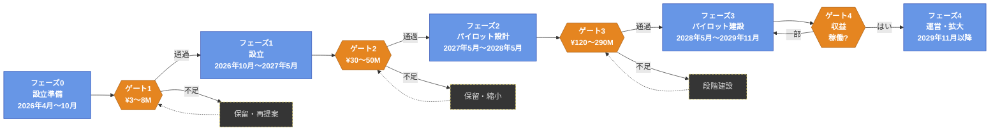

<!-- Version: v1.5 | Last modified: 2026-07-18 -->

# バイオマスエネルギーとAI — BIOMASS ENERGY & AI
### 御杖村における地域植林 — Reforesting in Mitsue

**農村日本における森林再生・分散型再生可能エネルギー・コミュニティ所有のデジタルインフラに向けた25年間の取り組み。**

> 先人が植えた森が、今、村を支える力になる。

| | |
|---|---|
| **所在地** | 奈良県御杖村 |
| **開始** | 2026年4月 |
| **期間** | 25年 |
| **現在のフェーズ** | フェーズ0 — 設立準備期（2026年4月〜10月） |
| **プロジェクトリード** | Rob Oudendijk（YR-Design / Safecast） |
| **文書ステータス** | 作業中草稿、2026年7月17日 |

---

## 1. エグゼクティブサマリー

バイオマスエネルギーとAIは、旧菅野小学校（御杖体験交流館）――有力候補――または村内の空き工場――代替候補――（最終選定は第1段階で確定）とその周辺の森林景観を、農村再生の統合的なモデルとして活用するための非営利イニシアチブです。本プロジェクトは、在来種の森林再生、杉林の間伐材を燃料とする地域産バイオマスCHP（熱電併給）エネルギー（太陽光・EV充電・地域バックアップ電源がこれを補完。蓄電池はフィージビリティスタディで判断）、小規模なコミュニティ所有のデータセンターという3つの相互補完的な活動を、単一の調整組織のもとに統合します。

本プロジェクトは**規模において控えめで、完全に透明性があり、自由に複製可能**であるよう設計されています。日本国内外の過疎化が進む他の市町村がこのモデルを自らの状況に合わせて応用できるよう配慮されています。25年という期間は意図的なもので、現在の農村部におけるエネルギー・デジタルの不足と、将来予測される小規模分散型核融合発電の実用化の間を橋渡しするものです。

---

## 2. ミッションとビジョン

**ミッション。** 農村の日本のコミュニティが、生態系の再生・地域産クリーンエネルギー・現代のデジタルインフラを統合することで、自らの持続可能な未来を築けることを実証し、学んだことを共有することで他のコミュニティがその後に続けるようにすること。

**ビジョン（2050年）。** 御杖村は農村再生の自立したモデルとなる。再生した在来種の森林、杉間伐材による地域産バイオマスCHPエネルギー、これを補完する太陽光・EV充電インフラ・地域バックアップ電源、小規模なコミュニティ所有のデータセンターが一体となって、村の経済・生態系・デジタルの未来を支える。このモデルはオープンに文書化され、それを応用したいと願うすべてのコミュニティが自由に利用できる。

---

## 3. 戦略的根拠

- **エネルギー転換。** 今後おおよそ10年以内に、日本の乗用車の大多数がEVになると見込まれている。この転換には、特にグリッド拡張が遅く資本集約的な農村地域において、分散型発電能力の大幅な拡充が必要となる。
- **森林資産の転換。** 日本の農村に広がる老齢スギ人工林は、生態的コスト（花粉負荷・生物多様性の喪失）と物理的リスク（土砂崩れ・火災）を伴う管理不足の資産である。積極的な管理によってこの負担を原料・木材収入へと転換できる。
- **地域資産の遊休化。** 旧菅野小学校（御杖体験交流館）や村内の空き工場などの遊休施設は、縮小する自治体予算に純粋な維持費をもたらしている。生産的な活用によって、地域に根ざした施設に変えることができる。
- **デジタルインフラ格差。** 農村部のブロードバンドとエッジコンピューティング能力は都市部の日本に対して依然として遅れている。エネルギーと連携した小規模データセンターは、接続性と現地計算処理の両方のギャップに対応する。

### 3.1 村の再エネ導入最大化計画との整合

2025年1月、御杖村は環境省補助事業として**「再エネ導入最大化計画（概要版）」**を公表した。これは2050年までを対象とする村の法定脱炭素戦略である。バイオマスエネルギーとAIは新しい構想の採用を村に求めているのではない——村がすでに策定し、予算をつけ、コミットしている計画を**実行・運営する事業体（官民連携 運営体制）**になることを申し出ているのである。本プロジェクトは、村内の「再エネ＋蓄電池＋EVのレジリエント1拠点」指標（現状ゼロ）、役場・道の駅等へのEV充電器優先整備（運輸部門が排出の46%）、自立分散型エネルギーの防災目標、そして計画が求めながら単独では実現できない森林炭素／J-クレジット機構を提供する。計画が環境省の計画づくり支援事業（第1段階）で完成したことにより、御杖村は**地域脱炭素移行・再エネ推進交付金**（第2段階）の対象となった——太陽光・蓄電池・EV・自営線設備費の2/3〜3/4が、官民連携を通じて村へ交付される。詳細な分析は [`mitsue_village_re_plan_alignment_jp.md`](docs/energy-forest/mitsue_village_re_plan_alignment_jp.md) 参照。

---

## 4. プログラムの構成要素

### 4.1 森林再生
民有地地主・林野庁・地域の林業業者と連携し、老齢スギ人工林を在来種の広葉樹に段階的に転換する。再生は25年の生態的タイムラインで進める。在来広葉樹（コナラ・クヌギ・クリなど）はシカ・イノシシ・クマの食料（どんぐり・木の実）を供給し、野生動物を森の中に留め、農作物への被害を軽減する。

### 4.2 バイオマスCHPエネルギー・太陽光・EV充電・地域レジリエンス
村の主たるエネルギー源は、杉林の間伐材を燃料とするバイオマス熱電併給（CHP）システムであり、24時間のベースロード電力（主たる出力）と熱（副次的な出力）を生み出す。森が村を動かすこの循環型の地域エネルギー経済を、プロジェクト拠点での太陽光発電、住民・来訪者向けEV充電、停電時の重要施設向けバックアップ電源が補完する。出力は地域消費（村のEV充電・データセンター稼働・停電時のバックアップ電源）を想定し、経済的に適切な場合はFIT/FIPによる系統売電も行う。

間欠的な太陽光だけと異なり、バイオマスCHPはデータセンターに必要な24時間のベースロードを供給する。バイオマスCHP＋太陽光＋EV充電システムは、データセンターへの安定電力供給とEV普及対応を同時に実現する。現地発電設備は停電時のバックアップ電源としても機能し、農村部の老朽化した配電線に対するレジリエンスを提供する。蓄電池の設置はフィージビリティスタディで判断する。

### 4.3 コミュニティ所有のデータセンター
旧菅野小学校（御杖体験交流館）――有力候補――または村内の空き工場――代替候補（最終選定は第1段階で確定）――を、地域由来の再生可能エネルギーで完全稼働する小規模・省エネのエッジコンピュータ施設として活用する。在来種の森林再生と地域由来のバイオマスCHP・太陽光エネルギーで動くコミュニティ所有のAIデータセンターを構築することで、農村コミュニティが技術的進歩と環境の持続可能性を一体として統合できることを実証する。対立するものとしてではなく、単一のシステムとして。施設の規模は、ハイパースケール経済ではなくコミュニティの説明責任に合わせて設定する。

### 4.4 EV充電ネットワーク
外部のグリッド拡張に依存せず、地域発電を基盤とした、住民および来訪者向けの分散型充電インフラの整備。

### 4.5 教育とオープンナレッジ
すべての手法・データ・財務記録・学びは、他のコミュニティが複製・応用できるよう、オープンライセンスのもとで公開する。

---

## 5. 段階的実施計画

最初の3年間は5つのフェーズに整理され、各フェーズには明確な資金調達チェックポイントが設けられている。保留・縮小分岐と資金調達源マップを含む完全なフェーズロジックは [`mitsue_phases_funding_flowchart.md`](docs/strategy/mitsue_phases_funding_flowchart.md) に記載されている。

```mermaid
flowchart LR
    P0["フェーズ0<br/>設立準備<br/>2026年4月〜10月"]
    P1["フェーズ1<br/>設立<br/>2026年10月〜2027年5月"]
    P2["フェーズ2<br/>パイロット設計<br/>2027年5月〜2028年5月"]
    P3["フェーズ3<br/>パイロット建設<br/>2028年5月〜2029年11月"]
    P4["フェーズ4<br/>運営・拡大<br/>2029年11月以降"]

    G1{{"ゲート1<br/>¥3〜8M"}}
    G2{{"ゲート2<br/>¥30〜50M"}}
    G3{{"ゲート3<br/>¥120〜290M"}}
    G4{{"ゲート4<br/>収益<br/>稼働?"}}

    H1["保留・再提案"]
    H2["保留・縮小"]
    H3["段階建設"]

    P0 --> G1
    G1 -->|通過| P1
    P1 --> G2
    G2 -->|通過| P2
    P2 --> G3
    G3 -->|通過| P3
    P3 --> G4
    G4 -->|はい| P4

    G1 -->|不足| H1 -.-> G1
    G2 -->|不足| H2 -.-> G2
    G3 -->|不足| H3 -.-> G3
    G4 -->|一部| P3

    classDef phase fill:#6796e6,stroke:#3655b5,stroke-width:1px,color:#FFFFFF,font-weight:bold
    classDef gate  fill:#e58520,stroke:#A85C10,stroke-width:1px,color:#FFFFFF,font-weight:bold
    classDef hold  fill:#353535,stroke:#FCEB6C,stroke-width:1px,color:#DEDEDE,stroke-dasharray:4 3
    class P0,P1,P2,P3,P4 phase
    class G1,G2,G3,G4 gate
    class H1,H2,H3 hold
```

| フェーズ | 期間 | 焦点 | 概算予算 |
|---------|------|------|---------|
| 0. 設立準備 | 2026年4月〜10月 | 地域の信頼構築・創設チーム・憲章草案 | ¥0〜0.5M（自己資金） |
| 1. 設立 | 2026年10月〜2027年5月 | 法人設立・実現可能性調査・専門家顧問 | ¥3〜8M |
| 2. パイロット設計 | 2027年5月〜2028年5月 | 詳細エンジニアリング・パートナーシップ・許認可 | ¥15〜30M |
| 3. パイロット建設 | 2028年5月〜2029年11月 | 第1段階建設・試運転 | ¥120〜290M |
| 4. 運営・拡大 | 2029年11月以降 | 運営・モニタリング・複製 | 変動 |

フェーズ間の資金調達ゲート：**G1 ¥3〜8M · G2 ¥30〜50M · G3 ¥120〜290M · G4 運営収益稼働**。ゲートを通過できない場合は、不十分なリソースで次フェーズに進むのではなく、保留・再提案サイクルに入る。

フェーズごとの成果物・ROIフレームワーク・リスク登録簿を含む詳細な計画は [`mitsue_implementation_plan_jp.md`](docs/strategy/mitsue_implementation_plan_jp.md) に記載されている。

---

## 6. 現在の状況 — フェーズ0

**期間：** 2026年4月〜10月 · **予算：** 自己資金 · **方針：** 公式発表なし、プレスなし。

### 完了済み
- 御杖村副村長との初回面談（2025年末）
- 地元林業グループとの初回面談（2026年初頭）
- 設立憲章と詳細実施計画の草案作成（2026年4月）
- フェーズ・資金調達ゲートフローチャートの公開（2026年5月）
- 諮問委員会の発足 — Ray Ozzie（2026年5月5日確認）、堂目卓生、San Poisson、エヴィン・ズート、ヨシコ・ズート鈴木（2026年5月）
- 村長面談トーキングポイントの作成（英語・日本語）（2026年5月）
- ヘンリー・誠一・高田（SynTech Japan）がバイオマスCHP顧問として参加（2026年6月）
- 菅野の燃料供給パートナー（丹羽製材）を特定し、林業従事者主導のエネルギー計画を作成（2026年6〜7月）
- more treesとの初回パートナーシップ面談を実施；収穫益による再植林の分担方針で基本合意（2026年7月14日）
- 国産CHPメーカー候補リスト、FIT/FIP系統接続チェック、森林→コンピュート資金・原料フロー図を作成（2026年7月）
- みずほ証券とのエンティティ構造面談に向けてビジネスケース・収益モデル・キャッシュフローモデル・EVM計画を更新（2026年8月5日）

### 進行中
- 農村での信頼性を持つ日本人共同創業者の特定（最優先）
- 村長との正式面談の日程調整
- 一般社団法人定款の草案作成
- 奈良県内の行政書士との連携

### 今後30日間
1. 日本人共同創業者候補にアプローチ
2. 村長との非公式面談の実施
3. 1〜2名の行政書士との初回相談
4. 配布用の2ページバイリンガル憲章の最終化

進行中のタスク一覧は [`mitsue_todo.xlsx`](mitsue_todo.xlsx) で管理されている（英語・日本語のPDFコピーはリポジトリにあり）。

---

## 7. ガバナンス

### 創設メンバー
- Rob Oudendijk — YR-Design / Safecast
- 日本人共同創業者 — 未定
- 追加創設メンバー — 未定（目標：合計3〜5名）

### 諮問委員会
- **Ray Ozzie** — Blues エグゼクティブ・チェア
- **堂目卓生** — 大阪大学教授・いのち会議 実行委員長
- **San Poisson** — プロジェクトマネージャー
- **エヴィン・ズート** — Transom 共同代表取締役
- **ヨシコ・ズート鈴木** — Transom 共同代表取締役
- **ヘンリー・誠一・高田（Henry Seiichi Takata）** — SynTech Japan；バイオマスCHP顧問（三重県プラント運営経験）

### 法人形態
- **現在：** 設立前
- **最初の6〜9ヶ月：** 一般社団法人として設立
- **第18〜24ヶ月：** 補助金へのアクセス拡大のためNPO法人（特定非営利活動法人）への移行を計画
- **長期：** 税控除対象寄付のための認定NPO法人の取得を目指す

### 設立文書
- [`mitsue_founding_charter.md`](docs/strategy/mitsue_founding_charter.md) — バイリンガル設立憲章（英語・日本語）
- [`mitsue_founder_agreement_template.md`](docs/strategy/mitsue_founder_agreement_template.md) — 創設者合意テンプレート

---

## 8. 資金調達戦略

本プロジェクトは5層の資金調達スタックを追求し、各層は前フェーズの成果によって解放される。この段階的な構造により、単一の資金源への早期依存を防ぐ。

| 層 | 資金源 | 第1年目目標 | 第3年目目標 |
|----|--------|------------|------------|
| L1 | 創設者・民間資本 | ¥3M | ¥1M |
| L2 | 政府補助金（NEDO・経産省・奈良県・御杖村；**御杖村 地域脱炭素移行・再エネ推進交付金 補助率2/3〜3/4、村経由**） | ¥5M | ¥80M |
| L3 | 財団（日本財団・地球環境基金・トヨタ財団など） | ¥3M | ¥20M |
| L4 | 企業パートナーシップ（オランダ・日本；CSR連携） | ¥0 | ¥30M |
| L5 | 運営収益（ホスティング料・FIT/FIP・EV充電料金・J-クレジット） | ¥0 | ¥3M |
| **合計（目安）** | | **¥11M** | **¥134M** |

これらの数値は計画目標であり、コミットメントではない。実際の資金調達ミックスは、フェーズ1・2における補助金の結果とパートナーシップ交渉によって決まる。

---

## 9. 運営原則

1. **地域優先。** あらゆる重要な意思決定は、御杖住民と土地所有者の幸福から始まる。
2. **オープンかつ透明。** 環境データ・財務記録・手法を公開する。
3. **忍耐と長期視点。** 25年の地平線；時期尚早な拡大は行わない。
4. **複製可能。** ドキュメント化の規律は後付けではなく成果物として扱う。
5. **規模において控えめ。** コミュニティへの説明責任を保てる規模に留まる。
6. **非党派。** 政治的立場を持たない；発言はプロジェクトのミッションの範囲に限る。

---

## 10. リポジトリの内容

このリポジトリには、プロジェクト最初の3年間を管理する作業文書が収録されている。主要ファイル：

| ファイル | 目的 |
|---------|------|
| `README.md` | 英語版README（本文書の英語版） |
| `README_jp.md` | 本文書（日本語版README） |
| `mitsue_founding_charter.md` / `.pdf` | バイリンガル設立憲章（英語・日本語） |
| `mitsue_implementation_plan.md` / `.pdf` | 詳細5フェーズ実施計画（英語） |
| `mitsue_implementation_plan_jp.md` / `.pdf` | 実施計画の日本語訳 |
| `mitsue_revenue_model.md` / `.pdf` | 収益ストリーム・コスト代替・回収フレームワーク まとめ（英語） |
| `mitsue_revenue_model_jp.md` / `.pdf` | 収益モデルまとめ（日本語版） |
| `mitsue_business_case.md` / `.pdf` | ビジネスケース（英語） |
| `mitsue_cashflow_model.md` / `.pdf` | キャッシュフローモデル（英語） |
| `mitsue_forest_workforce_energy_plan.md` | 林業従事者主導の25年森林→エネルギー計画 |
| `mitsue_chp_maker_shortlist.md` / `.pdf` | 国産バイオマスCHPメーカー候補リスト |
| `mitsue_fit_grid_check.md` / `.pdf` | FIT/FIP・系統接続チェック（御杖観光サイト） |
| `mitsue_forest_power_compute_loop.html` / `.pdf` | 森林→CHP→コンピュートの原料・資金フロー図 |
| `mitsue_phases_funding_flowchart.md` / `.pdf` | フェーズ構造と資金調達ゲート図 |
| `mitsue_village_government_onepager.md` / `.pdf` | 村行政向け1ページブリーフ（英語） |
| `mitsue_village_government_onepager_jp.md` / `.pdf` | 村行政向け1ページブリーフ（日本語） |
| `mitsue_mayor_meeting_talking_points.md` / `.pdf` | 村長との正式面談準備文書（英語） |
| `mitsue_mayor_meeting_talking_points_ja.md` | 村長面談トーキングポイント（日本語） |
| `mitsue_qa_briefing.md` | バイオマスCHPエネルギー・EV充電・停電レジリエンス・データセンター・太陽光・25年地平線に関するよくある質問への回答（バイリンガル） |
| `mitsue_founder_agreement_template.md` / `.pdf` | 創設者合意テンプレート |
| `mitsue_project_founding_story.md` / `.pdf` | 創設ストーリー文書（英語） |
| `mitsue_project_founding_story_jp.md` / `.pdf` | 創設ストーリー（日本語版） |
| `mitsue_stakeholders.md` | ステークホルダーエンティティリストと関係図（英語）、Mermaidダイアグラム付き |
| `mitsue_stakeholders_jp.md` | ステークホルダーリストと関係図（日本語版） |
| `mitsue_stakeholder_graph.html` | インタラクティブなステークホルダー関係グラフ（英語） |
| `mitsue_stakeholder_graph_jp.html` | インタラクティブなステークホルダー関係グラフ（日本語） |
| `mitsue_todo.xlsx` / `.pdf` | 作業タスクリスト（英語・日本語PDFあり） |
| `mitsue_finance.xlsx` | 財務計画ワークブック |
| `OPENPROJECT.md` | OpenProjectプロジェクト管理設定・API参照・Codebergドキュメントインデックス |
| `openproject_docker-compose.yml` | ローカルOpenProjectインスタンスのDocker Compose設定 |
| `openproject_backup.sh` / `openproject_restore.sh` | OpenProjectデータのバックアップ・リストアスクリプト |
| `openproject_backup.json` / `openproject_backup.sql` | 最新のOpenProjectワークパッケージエクスポートとPostgreSQLダンプ |

関連する作業フォルダ（林業調査・体験交流館・ビジュアルアセット）は、親ディレクトリ `Mitsue/` の下にある。

---

## 11. 連絡先

- **プロジェクトリード：** Rob Oudendijk
- **所属：** YR-Design · Safecast
- **所在地：** 奈良県御杖村
- **公式広報：** 未開始；プロジェクトは設立準備段階

ウェブサイトはすでに公開中。専用メール・NPO銀行口座などの正式なチャンネルはフェーズ1開始時に設立予定。

---

## 12. ライセンスとオープンデータ

すべてのプロジェクト文書・環境データ・手法は、プロジェクトのオープンナレッジへのコミットメントに沿って、寛容なオープンライセンス（文書はクリエイティブ・コモンズ；データとコードは適切なオープンライセンス）のもとで公開される予定。

---

*最終更新：2026年7月17日 · 管理者：Rob Oudendijk*
