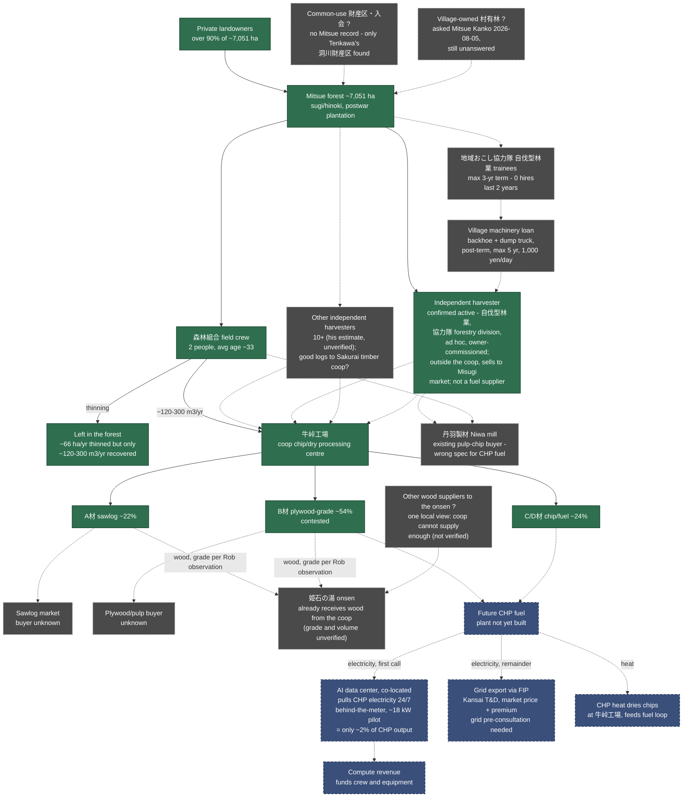

<!-- Version: v1.7 | Last modified: 2026-09-30 -->

# Mitsue Forest Supply Chain — What We Currently Have

Same shape as Rob's reference sketch, filled in with what's actually confirmed vs.
still unknown. **Solid arrow = sourced fact. Dashed arrow = unconfirmed / proposed /
future.** Downstream half (CHP → compute) is in
`../chp-technical/mitsue_forest_power_compute_loop.html` — this diagram is the
upstream half feeding it.

## Open questions (this is the real answer to "what do we have")

1. **村有林** — any village-owned forest usable without private contracts? Asked
   Mitsue Kanko 2026-08-05, still unanswered.
2. **財産区/入会 (common-use land)** — no evidence any exists in Mitsue; only
   confirmed example is Tenkawa's 洞川財産区. Don't assume Mitsue has an
   equivalent.
3. **Where does the independent harvester's felled timber actually go?** — answered 2026-09-30:
   his own wood goes to Misugi market (西垣林業); others reportedly send good logs to
   桜井木材共同組合 members. Coop/other operators' flows still unverified.
4. **How many *other* independent harvesters work the Mitsue area?** — one is confirmed
   active; he estimates 10+ operators exist (unverified, may not all be active).
   Village hall inquiry (2026-09-30) pending.
5. **The "3-year / 6-year" contract structure** — only sourced term found is
   地域おこし協力隊's national 3-year cap, plus the village machinery-loan
   ordinance's separate 5-year post-term loan window. No "6-year" figure exists
   in any doc or memory — if you have a source for that number, it needs adding.
6. **Does the coop actually thin members' forest, or do owners deal with harvesters directly?** —
   the confirmed harvester bypassed the coop (owner deal + joint 伐採届). Ask 2026-10-02.
7. **Reforestation in Mitsue** — 神末 clear-cut replanted with cherry; 土屋原 large clear-cut
   reportedly to be replanted (species unknown). Who funded/did it? Ask 2026-10-02.
8. **B-grade destination** (plywood buyer vs. CHP-by-default) — open per
   `mitsue_forest_workforce_energy_plan.md` §4a, affects real CHP fuel volume.

## Not shown here (separate, sourced elsewhere)

- **Onsen (姫石の湯)**: already receives wood (not heat) from the coop today. Rob's observation
  of the coop's storage suggests A and B grade; grade and volume are not documented. One local view is that the coop cannot supply enough, so the onsen also gets wood from other places (unverified; suppliers unknown). CHP heat
  cannot be piped from 牛峠工場 to the onsen, so that link is not shown.
- **Scale check**: the data center is a small load (~18 kW, about 2% of a ~1.15 MWe plant).
  Its value is stable 24/7 baseload and a high-value use for the CHP's electrons, not volume.
  Most output goes to the grid via FIP. Source: `mitsue_forest_workforce_energy_plan.md` §5.
- **Permits/authorization**: 伐採届 (owner/buyer files, 90–30 days pre-felling),
  森林経営計画 (5-yr plan, owner or coop-filed, unlocks FIT premium),
  森林経営管理制度 consignment to village (legally available, owner-intent survey
  deliberately not run per Mayor 2020) — see `mitsue_forest_permit_subsidy_fit_reference.md`.
- **Money**: 森林環境譲与税 (¥26–38M/yr) → 施業放置林整備事業 (village-funded
  40% thinning, coop-contracted, ~2,600 ha backlog) and 美しい森づくり補助金
  (50% reimbursement, NPOs eligible) — see
  `../history/council_minutes_forestry_findings.md` §2.1–2.3 and
  `mitsue_forest_permit_subsidy_fit_reference.md`.
