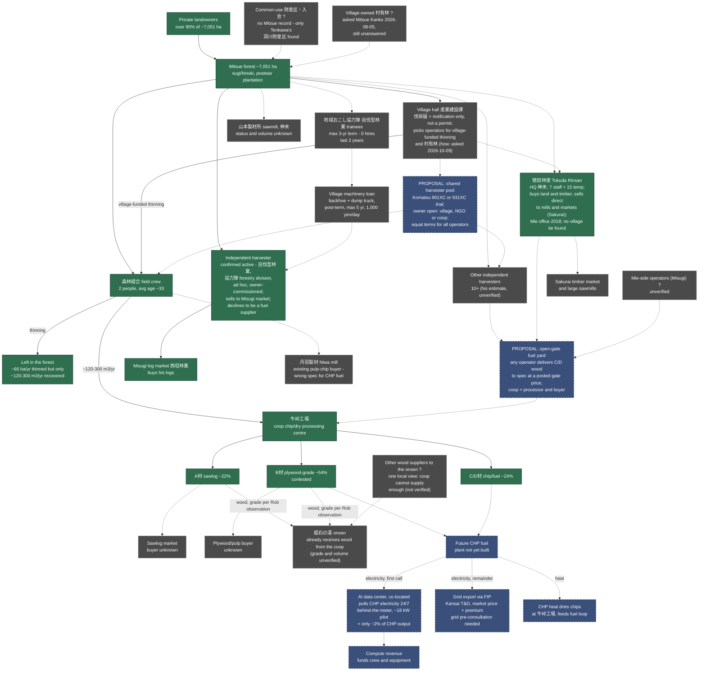

<!-- Version: v1.8 | Last modified: 2026-10-09 -->

# Mitsue Forest Supply Chain — What We Currently Have

Same shape as Rob's reference sketch, filled in with what's actually confirmed vs.
still unknown. **Solid arrow = sourced fact. Dashed arrow = unconfirmed / proposed /
future.** Downstream half (CHP → compute) is in
`../chp-technical/mitsue_forest_power_compute_loop.html` — this diagram is the
upstream half feeding it.

## Open questions (this is the real answer to "what do we have")

1. **Village-owned forest (村有林)?** Asked 2026-08-05, no answer.
2. **Common-use land (財産区・入会)?** No Mitsue record; only Tenkawa confirmed.
3. **Where does wood go?** Yamaguchi to Misugi market; Tokuda to mills and Sakurai market (its own site); coop flows unverified.
4. **Who else is active?** 10+ independents (his estimate); 山本製材所 (神末) status unknown; Mie-side operators unverified.
5. **Does Tokuda cut inside Mitsue,** or mostly Mie and Sakurai? Asked Ohba-san 2026-10-09 (awaiting reply).
6. **How are operators chosen** for village-funded thinning and 村有林? Asked 2026-10-09.
7. **Owners:** any group or owner-intent survey results? Coop member count and forest area? Asked 2026-10-09.
8. **Coop finances:** no document seen; "coop in trouble" is a hypothesis only.
9. **Onsen wood:** which grades and volumes, and from whom besides the coop?
10. **B-grade destination** (plywood buyer or CHP fuel) sets real CHP fuel volume.
11. **Proposals to test with the coop:** open-gate yard, shared harvester and who owns it.

## Not shown here (separate, sourced elsewhere)

- **Onsen (姫石の湯)**: already receives wood (not heat) from the coop today. Rob's observation
  of the coop's storage suggests A and B grade; grade and volume are not documented. One local view is that the coop cannot supply enough, so the onsen also gets wood from other places (unverified; suppliers unknown). CHP heat
  cannot be piped from 牛峠工場 to the onsen, so that link is not shown.
- **Scale check**: the data center is a small load (~18 kW, about 2% of a ~1.15 MWe plant).
  Its value is stable 24/7 baseload and a high-value use for the CHP's electrons, not volume.
  Most output goes to the grid via FIP. Source: `mitsue_forest_workforce_energy_plan.md` §5.
- **Permits/authorization**: 伐採届 (owner/buyer files, 90–30 days pre-felling),
  森林経営計画 (5-yr plan, owner or coop-filed, unlocks FIT premium),
  森林経営管理制度 consignment to village (legally available, owner-intent survey
  deliberately not run per Mayor 2020) — see `mitsue_forest_permit_subsidy_fit_reference.md`.
- **Money**: 森林環境譲与税 (¥26–38M/yr) → 施業放置林整備事業 (village-funded
  40% thinning, coop-contracted, ~2,600 ha backlog) and 美しい森づくり補助金
  (50% reimbursement, NPOs eligible) — see
  `../history/council_minutes_forestry_findings.md` §2.1–2.3 and
  `mitsue_forest_permit_subsidy_fit_reference.md`.
