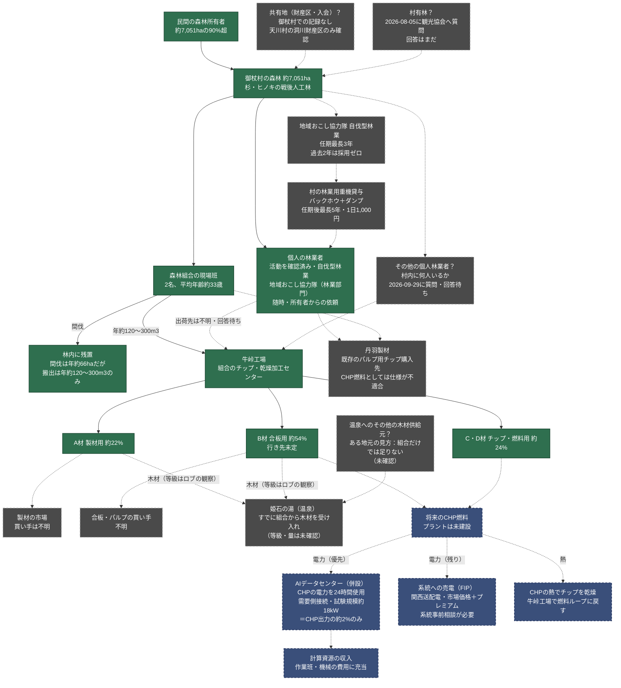

<!-- Version: v1.4 | Last modified: 2026-09-30 -->

# 御杖村の森林・木材の流れ ― 現在わかっていること

確認できた事実と、まだ不明な点を分けて図にしました。**実線＝出典のある事実、点線＝未確認・提案・将来。**
下流側（CHP→計算資源）は `../chp-technical/mitsue_forest_power_compute_loop.html` にあり、この図はその上流側です。

## 未確認事項（「現在何があるか」の実質的な答え）

1. **村有林** ― 民間との契約なしで使える村有林はあるか。2026-08-05に観光協会へ質問済み、回答なし。
2. **財産区・入会（共有地）** ― 御杖村に存在する形跡なし。確認できた例は天川村の洞川財産区のみ。御杖村にもあると想定しないこと。
3. **個人林業者が伐採した木材の行き先** ― 製材所・チップ業者・市場のどれか。2026-09-29に質問済み、回答待ち。
4. **確認済みの1名以外に、村内で活動する個人林業者は何人いるか** ― 1名の活動は確認済み、他は未確認。2026-09-30にむらづくり振興課へ問い合わせ済み。
5. **「3年／6年」の契約形態** ― 出典があるのは、地域おこし協力隊の任期上限3年と、任期後の重機貸与の5年のみ。「6年」の根拠はどの資料にもなし。
6. **B材の行き先**（合板の買い手か、CHP燃料か）― 実際のCHP燃料量に影響する。

## この図に含めていないもの（別資料に記載）

- **温泉（姫石の湯）**：現在すでに組合から木材（熱ではなく）を受け入れています。組合の貯木場の様子からA材・B材と見られますが、等級と量は記録がなく未確認です。ある地元の見方として、組合だけでは足りないため温泉は他の場所からも木材を得ているとされています（未確認、供給元は不明）。牛峠工場のCHPから温泉へ熱は送れないため、その線は描いていません。
- **許認可**：伐採届（所有者または立木の買い手が提出、伐採開始の90〜30日前）、森林経営計画（5か年計画、所有者または組合が提出、FIT加算に必要）、森林経営管理制度による村への委託（制度上は可能だが、意向調査は2020年に村長が意図的に見送り）。
- **資金**：森林環境譲与税（年2,600〜3,800万円）→ 施業放置林整備事業（村費による40%間伐、組合受託、放置林約2,600ha）、美しい森づくり補助金（50%補助、後払い、NPOも対象）。
