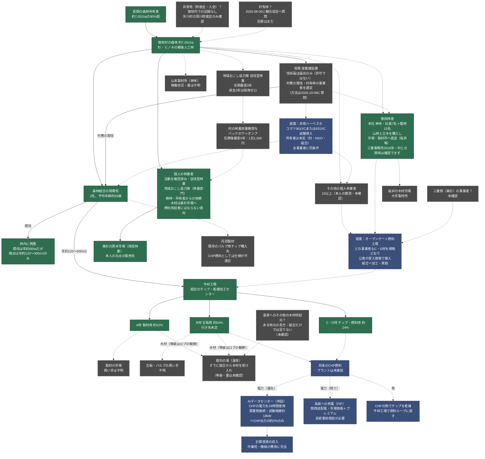

<!-- Version: v1.6 | Last modified: 2026-10-09 -->

# 御杖村の森林・木材の流れ ― 現在わかっていること

確認できた事実と、まだ不明な点を分けて図にしました。**実線＝出典のある事実、点線＝未確認・提案・将来。**
下流側（CHP→計算資源）は `../chp-technical/mitsue_forest_power_compute_loop.html` にあり、この図はその上流側です。

## 未確認事項（「現在何があるか」の実質的な答え）

1. **村有林はあるか？** 2026-08-05に質問、回答なし。
2. **共有地（財産区・入会）は？** 御杖村の記録なし。確認できたのは天川村のみ。
3. **木材の行き先：**個人林業者は美杉市場へ、徳田林産は製材所・桜井市場へ（同社サイト）。組合の流れは未確認。
4. **他に誰が活動しているか？** 個人林業者10以上（本人の推測）、山本製材所（神末）の状況は不明、三重側の事業者は未確認。
5. **徳田林産は村内で伐採しているか、**主に三重・桜井か？ 大場様へ2026-10-09に質問（返信待ち）。
6. **村費の間伐・村有林の事業者はどう選ばれるか？** 2026-10-09に質問。
7. **所有者：**会や意向調査の結果は？ 組合員数・面積は？ 2026-10-09に質問。
8. **組合の経営状況：**資料は未確認。「経営難」は仮説にすぎない。
9. **温泉の木材：**等級・量、組合以外の供給元は？
10. **B材の行き先**（合板か、CHP燃料か）で実際のCHP燃料量が変わる。
11. **組合と検討する提案：**オープンゲート土場、共有ハーベスタ、その所有者。

## この図に含めていないもの（別資料に記載）

- **温泉（姫石の湯）**：現在すでに組合から木材（熱ではなく）を受け入れています。組合の貯木場の様子からA材・B材と見られますが、等級と量は記録がなく未確認です。ある地元の見方として、組合だけでは足りないため温泉は他の場所からも木材を得ているとされています（未確認、供給元は不明）。牛峠工場のCHPから温泉へ熱は送れないため、その線は描いていません。
- **許認可**：伐採届（所有者または立木の買い手が提出、伐採開始の90〜30日前）、森林経営計画（5か年計画、所有者または組合が提出、FIT加算に必要）、森林経営管理制度による村への委託（制度上は可能だが、意向調査は2020年に村長が意図的に見送り）。
- **資金**：森林環境譲与税（年2,600〜3,800万円）→ 施業放置林整備事業（村費による40%間伐、組合受託、放置林約2,600ha）、美しい森づくり補助金（50%補助、後払い、NPOも対象）。
