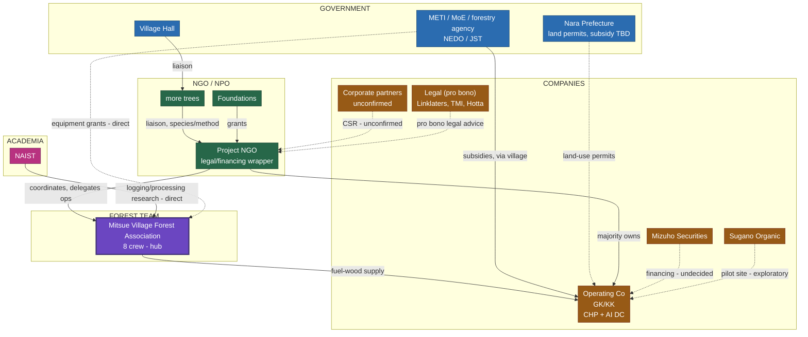

<!-- Version: v1.0 | Last modified: 2026-09-21 -->

PROJECT DOCUMENT · DISCUSSION DRAFT

<h1 style="font-size:20pt; font-weight:700; margin:0 0 1mm;">Stakeholder Network — Forest-Led Model</h1>

Mitsue AI Data Center &amp; Biomass Energy Project

v1.0 · 2026-09-21 · Rob Oudendijk

> **Very early draft — concept only.** Nothing here is decided or agreed. Starting point for discussion, not a proposal to sign. Alternative to the NGO-led model in `mitsue_kanko_collaboration_diagrams`: here the Mitsue Village Forest Association (8-crew forestry cooperative) is the operational hub for logging, replanting and processing, with the NGO delegating day-to-day coordination rather than running it directly.

## Network diagram

## Legend

<table style="width:100%; border:none; border-collapse:collapse; margin:2mm 0;"><tr>
<td style="border:none; padding:1mm 4mm 1mm 0; font-size:8.5pt;">Government</td>
<td style="border:none; padding:1mm 4mm 1mm 0; font-size:8.5pt;">NGO / NPO</td>
<td style="border:none; padding:1mm 4mm 1mm 0; font-size:8.5pt;">Company</td>
</tr><tr>
<td style="border:none; padding:1mm 4mm 1mm 0; font-size:8.5pt;">Forest Team (co-op)</td>
<td style="border:none; padding:1mm 4mm 1mm 0; font-size:8.5pt;">Academia</td>
<td style="border:none; padding:1mm 4mm 1mm 0; font-size:8.5pt;">— solid arrow: planned/structural link &nbsp;·&nbsp;  dashed: tentative / unconfirmed</td>
</tr></table>

**Reading the diagram:** liaison runs Village Hall → more trees → NGO; the NGO delegates day-to-day coordination to the Mitsue Village Forest Association (8-crew hub), which in turn supplies fuel-wood to the Operating Company. NAIST's research link goes direct to the Forest Team, not through the NGO. Dashed edges (equipment grants, land-use permits, Mizuho financing, corporate CSR, Sugano pilot site, pro bono legal) are not yet confirmed in writing.

## Node detail

| Node | Group | Role / status |
|---|---|---|
| Village Hall | Government | Formal liaison entry point; grants land/permits to Operating Co |
| Nara Prefecture | Government | Land-use permits, subsidy — TBD (tentative) |
| METI / MoE / forestry agency / NEDO / JST | Government | National subsidy sources; forest/RE-type via village, DC/power-type via Operating Co |
| Project NGO (一般社団法人) | NGO/NPO | Non-distributing legal/financing wrapper; majority owner of Operating Co |
| more trees | NGO/NPO | Liaison + replanting species/method partner between Village Hall and NGO |
| Foundations | NGO/NPO | Grant source into NGO — target ¥33M, ¥0 secured to date (see funding flowchart) |
| Mitsue Village Forest Association | Forest Team | 8-crew forestry cooperative; operational hub for logging, replanting, processing under this model |
| Operating Co (GK/KK) | Company | CHP + AI Data Center operating entity, majority-owned by the NGO |
| Mizuho Securities | Company | Financing option — undecided (tentative) |
| Sugano Organic | Company | Exploratory pilot CHP site (tentative) |
| Corporate partners | Company | Unconfirmed CSR/sponsorship (tentative) |
| Legal (pro bono) | Company | Linklaters (Watanabe), TMI (Nakano), likely Nishimura & Asahi (Hotta) — all confirmed pro bono, no written engagement letter |
| NAIST | Academia | Direct research link to the Forest Team (logging/processing); contact via Kubo (CDG), introduced by President Shiozaki — relationship still developing, not yet a formal MOU |

---

*This is the forest-team-led alternative to the NGO-led coordination model in `mitsue_kanko_collaboration_diagrams`. Source: repo docs (`mitsue_kanko_forest_led_diagrams_a3.html` panel 4), cross-checked against project notes as of 2026-09-21.*

<table style="width:100%; border:none; border-collapse:collapse; margin-top:2mm;"><tr>
<td style="border:none; vertical-align:middle;">
<em>Mitsue AI Data Center · Mitsue Village, Nara</em> 
<em>Contact: Rob Oudendijk · oudendijk.biz@gmail.com · 080-2260-5966</em>
</td>
<td style="border:none; vertical-align:middle; text-align:right; width:100px;">
<a href="https://mitsue.it"><strong>mitsue.it</strong></a> 

</td>
</tr></table>
