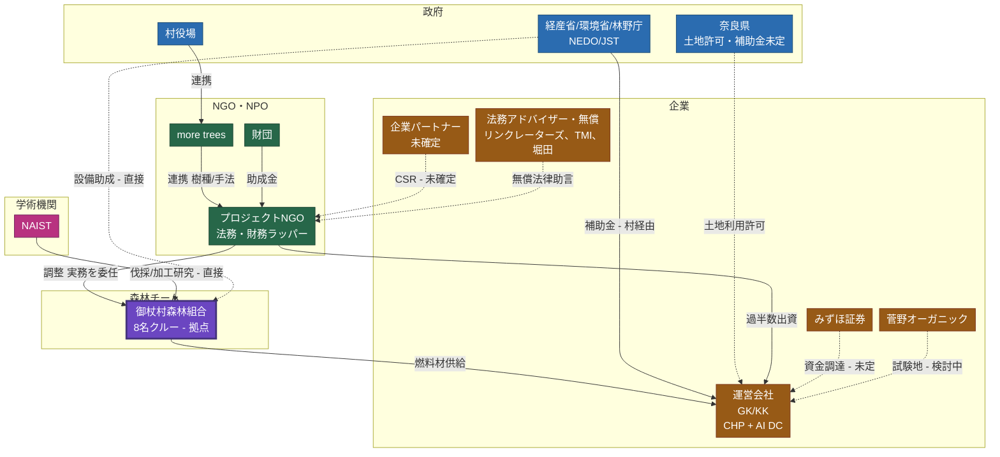

<!-- Version: v1.0 | Last modified: 2026-09-21 -->

プロジェクト文書 ・ 検討用ドラフト

<h1 style="font-size:20pt; font-weight:700; margin:0 0 1mm;">ステークホルダー関係図 — 森林チーム主導モデル</h1>

御杖村 AIデータセンター＆バイオマスエネルギープロジェクト

v1.0 · 2026-09-21 · ロブ・アウデンダイク

> **ごく初期の検討案です。** ここに記載の内容は何も確定・合意しておらず、議論のたたき台にすぎません。署名を前提とした提案ではありません。`mitsue_kanko_collaboration_diagrams`（NGO主導モデル）の代替案として、ここでは御杖村森林組合（8名クルー）を伐採・植林・加工の実務拠点とし、NGOが日常のオペレーション調整を委任する形を示しています。

## 関係図

## 凡例

<table style="width:100%; border:none; border-collapse:collapse; margin:2mm 0;"><tr>
<td style="border:none; padding:1mm 4mm 1mm 0; font-size:8.5pt;">政府</td>
<td style="border:none; padding:1mm 4mm 1mm 0; font-size:8.5pt;">NGO・NPO</td>
<td style="border:none; padding:1mm 4mm 1mm 0; font-size:8.5pt;">企業</td>
</tr><tr>
<td style="border:none; padding:1mm 4mm 1mm 0; font-size:8.5pt;">森林チーム（組合）</td>
<td style="border:none; padding:1mm 4mm 1mm 0; font-size:8.5pt;">学術機関</td>
<td style="border:none; padding:1mm 4mm 1mm 0; font-size:8.5pt;">— 実線：計画・構造上のつながり &nbsp;·&nbsp;  点線：未確定・検討中</td>
</tr></table>

**図の読み方：** 連携の流れは村役場 → more trees → NGO。NGOは御杖村森林組合（8名クルー拠点）に日常のオペレーション調整を委任し、組合は運営会社へ燃料材を供給します。NAISTの研究連携はNGOを介さず組合へ直接つながります。点線（設備助成、土地利用許可、みずほの資金調達、企業CSR、菅野の試験地、無償法律助言）はまだ文書で確定していない関係を示します。

## ノード詳細

| ノード | 分類 | 役割・現状 |
|---|---|---|
| 村役場 | 政府 | 正式な連携窓口。運営会社への土地・許可を付与 |
| 奈良県 | 政府 | 土地利用許可、補助金は未定（検討中） |
| 経産省・環境省・林野庁・NEDO・JST | 政府 | 国の補助金源。森林・再エネ系は村経由、DC・電力系は運営会社経由 |
| プロジェクトNGO（一般社団法人） | NGO・NPO | 非分配型の法務・財務ラッパー。運営会社の過半数出資者 |
| more trees | NGO・NPO | 村役場とNGOをつなぐ連携役、植林の樹種・手法パートナー |
| 財団 | NGO・NPO | NGOへの助成金源 — 目標¥33M、現時点の確保額¥0（資金調達フローチャート参照） |
| 御杖村森林組合 | 森林チーム | 8名クルーの森林組合。本モデルでは伐採・植林・加工の実務拠点 |
| 運営会社（GK/KK） | 企業 | CHP＋AIデータセンターの運営主体、NGOが過半数出資 |
| みずほ証券 | 企業 | 資金調達の選択肢 — 未定（検討中） |
| 菅野オーガニック | 企業 | 試験的なCHP候補地（検討中） |
| 企業パートナー | 企業 | CSR・協賛は未確定（検討中） |
| 法務アドバイザー（無償） | 企業 | リンクレーターズ（渡邊氏）、TMI（中野氏）、おそらく西村あさひ（堀田氏） — いずれも無償support確定済み、書面での契約はまだなし |
| NAIST | 学術機関 | 森林チームへの研究連携（伐採・加工）。窓口は久保氏（CDG）、塩崎学長の紹介 — 関係は発展途上で、正式なMOUはまだなし |

---

*本図は`mitsue_kanko_collaboration_diagrams`（NGO主導モデル）に対する森林チーム主導の代替案です。出典：リポジトリ内`mitsue_kanko_forest_led_diagrams_a3.html`パネル4、2026-09-21時点のプロジェクト記録と照合済み。*

<table style="width:100%; border:none; border-collapse:collapse; margin-top:2mm;"><tr>
<td style="border:none; vertical-align:middle;">
<em>御杖村 AIデータセンタープロジェクト</em> 
<em>連絡先：ロブ・アウデンダイク · oudendijk.biz@gmail.com · 080-2260-5966</em>
</td>
<td style="border:none; vertical-align:middle; text-align:right; width:100px;">
<a href="https://mitsue.it"><strong>mitsue.it</strong></a> 

</td>
</tr></table>
