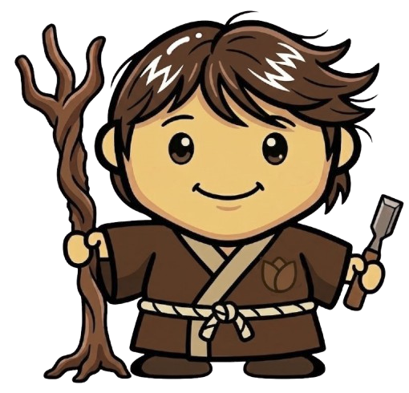

<!-- Version: v1.1 | Last modified: 2026-08-21 -->

# バイオマスエネルギーとAI — 御杖村における地域植林
### 農村日本における森林再生・分散型再生可能エネルギー・コミュニティ所有デジタルインフラへの25年間の取り組み

**所在地:** 奈良県御杖村　**開始:** 2026年4月　**期間:** 25年　**現在:** フェーズ0（設立準備期）
**プロジェクトリード:** Rob Oudendijk（YR-Design / Safecast）

---

**概要**

老齢化した杉人工林と、村内の遊休施設（旧菅野小学校ほか）、周辺の森林景観を活用し、農村再生の統合モデルを構築する非営利イニシアチブです。以下の3つの活動を単一の運営体制のもとで統合します。

1. **在来種の森林再生** — 民有地地主・林野庁・地域林業者と連携し、老齢スギ人工林を段階的にコナラ・クヌギ・クリなど在来広葉樹へ転換。シカ・イノシシ・クマの食料源を確保し、獣害軽減と生物多様性回復を同時に図る、25年スパンの生態的タイムライン。
2. **地域産バイオマスCHPエネルギー** — 間伐材を燃料に24時間ベースロード電力と熱を供給。太陽光・EV充電・地域バックアップ電源が補完。
3. **コミュニティ所有の小規模データセンター** — 地域再生可能エネルギーで稼働するエッジコンピュート施設。

発電した電力は村内利用にとどまらず、FIT/FIP制度による売電およびAIデータセンターへの供給という2つの商業的な出口を持ちます。この収益が森林再生プログラムの継続的な資金源となり、事業全体を自走可能にします。

**御杖村の公式計画との整合**

本プロジェクトは、村が2025年1月に公表した「再エネ導入最大化計画」を新たに提案するものではなく、村がすでに策定・コミットした計画を実行する官民連携の運営体制になることを目指しています。

**なぜ迫田様のご研究と重なるか**

再造林・種苗に関する研究の知見は、老齢スギ人工林を在来広葉樹へ転換する本プロジェクトの森林再生プログラムに直接活かせると考えており、ぜひ知見を共有させていただきたいと考えております。

**現在の進捗（フェーズ0）**

村副村長・地元林業グループとの面談、設立憲章・実施計画の草案化、advisory board発足（Ray Ozzie ほか）、CHP顧問（SynTech Japan）参画、more trees社との協業合意、みずほ証券とのエンティティ構造協議など。

**連絡先**
Rob Oudendijk / rob@yr-design.biz / [mitsue.it](https://mitsue.it)
