<!-- Version: v3.0 | Last modified: 2026-08-14 -->

PROJECT DOCUMENT

<h1 style="font-size:22pt; font-weight:700; margin:0 0 1mm;">BIOMASS ENERGY & AI</h1>

Phases &amp; Funding Flowchart

v3.0 · 2026-08-14 · Rob Oudendijk

> **Nothing is secured yet.** This is a target/pipeline funding stack, not raised money — see table on page 2.

## Phase Spine &amp; Funding Stack

```mermaid
%%{init: {'theme':'base','flowchart':{'htmlLabels':false},'themeVariables':{
  'background':'#404040',
  'primaryColor':'#6796e6','primaryTextColor':'#FFFFFF','primaryBorderColor':'#3655b5',
  'lineColor':'#A8A8A8','textColor':'#1A1A1A',
  'edgeLabelBackground':'#FCEB6C',
  'fontFamily':'Segoe UI, Helvetica, sans-serif',
  'fontSize':'30px'
}}}%%
flowchart LR
    P0["Phase 0<br/>Pre-Foundation"] --> G1{"Gate 1<br/>¥3–8M"}
    G1 --> P1["Phase 1<br/>Foundation"] --> G2{"Gate 2<br/>¥30–50M"}
    G2 --> P2["Phase 2<br/>Pilot Design"] --> G3{"Gate 3<br/>¥120–290M"}
    G3 --> P3["Phase 3<br/>Pilot Build"] --> G4{"Gate 4<br/>Revenue?"}
    G4 --> P4["Phase 4<br/>Operate / Scale"]

    F1["L1 Founders<br/>¥6M"] --> G1
    F2["L2 Gov Grants<br/>¥115M"] --> G2
    F3["L3 Foundations<br/>¥33M"] --> G2
    F2 --> G3
    F3 --> G3
    F4["L4 Corporate<br/>¥35M"] --> G3
    F5["L5 Revenue<br/>¥3M"] --> G4

    P1 -.->|Feasibility study<br/>unlocks grants| F2
    P1 -.->|Legal entity<br/>unlocks foundations| F3
    P3 -.->|Working pilot<br/>unlocks corporates| F4
    P3 -.->|Operations begin<br/>generate revenue| F5

    classDef phase fill:#6796e6,stroke:#3655b5,stroke-width:1px,color:#000000,font-weight:bold
    classDef gate  fill:#e58520,stroke:#A85C10,stroke-width:1px,color:#000000,font-weight:bold
    classDef fund  fill:#D9D9D9,stroke:#6796e6,stroke-width:1.4px,color:#000000
    class P0,P1,P2,P3,P4 phase
    class G1,G2,G3,G4 gate
    class F1,F2,F3,F4,F5 fund

    linkStyle default stroke:#A8A8A8,stroke-width:1.4px,color:#000000
```

**How to read it:** Follow the main spine left to right — the five project phases. Orange diamonds are funding gates: each asks "have we secured enough to proceed?" A gate that falls short holds the project and triggers a re-pitch, rather than advancing. The grey boxes (L1–L5) are the five funding layers feeding each gate. Dotted arrows are the feedback loop — finishing a phase produces deliverables (feasibility study, legal entity, working pilot) that unlock the *next* funding layer. That loop is the engine that lets the project grow without permanent outside subsidy.

## Funding Stack — Target / Pipeline (Baseline Rev 1) — nothing secured yet

| Layer | Source | Target | Secured to date |
|---|---|---|---|
| L1 — Founders | Founder capital (Rob Oudendijk) | ¥6M | ¥0 |
| L2 — Government Grants | National / prefectural / municipal | ¥115M | ¥0 |
| L3 — Foundations | Philanthropic foundations | ¥33M | ¥0 |
| L4 — Corporate Partners | Corporate sustainability / CSR | ¥35M | ¥0 |
| L5 — Operating Revenue | Early data center / energy / EV revenue | ¥3M | ¥0 |
| **Total Funding Target** | | **¥192M** | **¥0** |
| **BAC (project budget baseline)** | | **¥220M** | |
| **+ Management Reserve** | | ¥25M | |
| **Total Project Budget** | | **¥245M** | |
| **Funding Gap vs BAC** (if target stack fully lands) | | **¥28M** | |
| **Funding Gap vs Total Budget** (if target stack fully lands) | | **¥53M** | |

> **Nothing is committed yet.** As of 2026, ¥0 has actually landed across all five layers — including L1 founder capital. Every figure above is a planning target, to be replaced with confirmed amounts as agreements land. If the ¥192M target stack is not fully realized, the true shortfall is larger than ¥28–53M.
>
> **Named path for part of the gap:** the village-led 地域脱炭素移行・再エネ推進交付金 (MoE) — 2/3–3/4 subsidy on solar/battery/EV/private-wire capex, paid to the village via 官民連携, targeting Phases 2–3.
>
> **Cashflow timing matters as much as the total.** Even in the best case where the full ¥192M lands as planned, the modeled cash balance goes negative around Phase 3 (bottoming near −¥28M) — so funding must be secured and *disbursable* before Gate 3, not at project end. A ~¥25M bridge facility is the planned shock absorber for that peak.

---

*Sources: MoE 地域脱炭素移行・再エネ推進交付金 — https://policies.env.go.jp/policy/roadmap/grants/*

<table style="width:100%; border:none; border-collapse:collapse; margin-top:2mm;"><tr>
<td style="border:none; vertical-align:middle;">
<em>The BIOMASS ENERGY & AI project · Mitsue Village, Nara Prefecture, Japan</em> 
<em>Contact: Rob Oudendijk · oudendijk.biz@gmail.com · 080-2260-5966</em>
</td>
<td style="border:none; vertical-align:middle; text-align:right; width:100px;">
<a href="https://mitsue.it"><strong>mitsue.it</strong></a> 

</td>
</tr></table>
