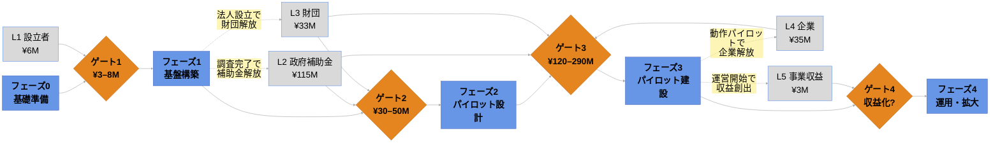

<!-- Version: v3.0 | Last modified: 2026-08-14 -->

PROJECT DOCUMENT

<h1 style="font-size:22pt; font-weight:700; margin:0 0 1mm;">バイオマスエネルギーとAI</h1>

フェーズ・資金調達フローチャート

v3.0 · 2026-08-14 · ロブ・アウデンダイク

> **現時点で確保済みの資金はありません。** 下表（2ページ目）のとおり、目標・パイプラインであり、確保済みの資金ではありません。

## フェーズと資金調達スタック

**読み方：** 中心の流れを左から右へ — 5つのフェーズです。オレンジのひし形が資金調達ゲート：それぞれ「次に進むための資金は確保できたか」を問います。不足すれば前進せず、保留・再提案となります。グレーの箱（L1〜L5）は各ゲートに資金を供給する5つの層です。点線矢印はフィードバックループ — フェーズの完了が生む成果物（調査結果・法人設立・動作パイロット）が次の資金層を解放します。このループこそが、外部補助金に恒久的に依存せず成長できるプロジェクトのエンジンです。

## 資金調達スタック — 目標・パイプライン（Baseline Rev 1）— 現時点で確保済みの資金はゼロ

| レイヤー | 調達元 | 目標額 | 現時点の確保額 |
|---|---|---|---|
| L1 — 設立者 | 設立者出資（ロブ・アウデンダイク） | ¥6M | ¥0 |
| L2 — 政府補助金 | 国・県・市町村 | ¥115M | ¥0 |
| L3 — 財団 | 慈善財団 | ¥33M | ¥0 |
| L4 — 企業パートナー | 企業サステナビリティ・CSR | ¥35M | ¥0 |
| L5 — 事業収益 | データセンター・エネルギー・EVの初期収益 | ¥3M | ¥0 |
| **資金調達目標合計** | | **¥192M** | **¥0** |
| **BAC（予算ベースライン）** | | **¥220M** | |
| **＋マネジメント予備費** | | ¥25M | |
| **総プロジェクト予算** | | **¥245M** | |
| **BAC対資金不足額**（目標スタック全額実現時） | | **¥28M** | |
| **総予算対資金不足額**（目標スタック全額実現時） | | **¥53M** | |

> **現時点で確保済みの資金はありません。** 2026年時点で、L1設立者出資を含む5層すべてで実際に確保された金額は¥0です。すべての数字は計画上の目標であり、合意成立とともに確定額へ置き換えます。¥192Mの目標スタックが全額実現しない場合、実際の不足は¥28M〜¥53Mより大きくなります。
>
> **不足の一部を埋める具体的な道筋：** 村主導の地域脱炭素移行・再エネ推進交付金（環境省）— 太陽光・蓄電池・EV・自営線設備費の2/3〜3/4補助、官民連携を通じて村へ交付、フェーズ2〜3が対象。
>
> **資金確保のタイミングも総額と同じくらい重要です。** ¥192M全額が計画どおり実現する最良ケースでも、モデル上の資金残高はフェーズ3付近でマイナスとなり（底値は約−¥28M）、資金はプロジェクト終了時ではなく**ゲート3までに確保・支出可能**である必要があります。そのピークの緩衝材として約¥25Mのブリッジ枠を計画しています。

---

*出典：環境省 地域脱炭素移行・再エネ推進交付金 — https://policies.env.go.jp/policy/roadmap/grants/*

<table style="width:100%; border:none; border-collapse:collapse; margin-top:2mm;"><tr>
<td style="border:none; vertical-align:middle;">
<em>バイオマスエネルギーとAI · 奈良県御杖村</em> 
<em>連絡先：ロブ・アウデンダイク · oudendijk.biz@gmail.com · 080-2260-5966</em>
</td>
<td style="border:none; vertical-align:middle; text-align:right; width:100px;">
<a href="https://mitsue.it"><strong>mitsue.it</strong></a> 

</td>
</tr></table>
