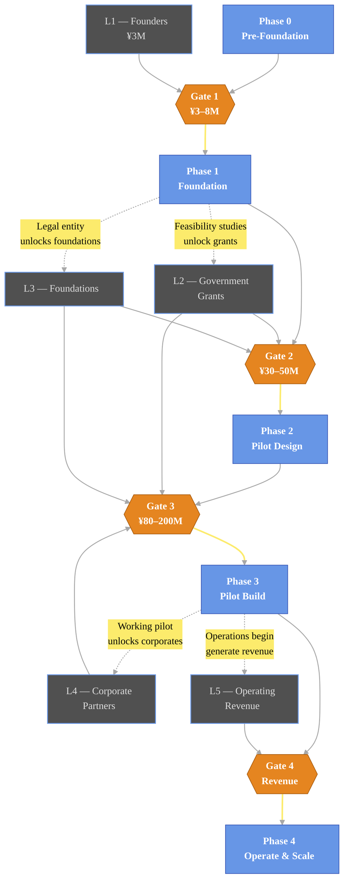

# Mitsue Project — Phases & Funding Flowchart

## Diagram 1 — Phase Spine with Funding Gates

```mermaid
%%{init: {'theme':'base','flowchart':{'htmlLabels':true},'themeVariables':{
  'background':'#404040',
  'primaryColor':'#6796e6','primaryTextColor':'#FFFFFF','primaryBorderColor':'#3655b5',
  'lineColor':'#A8A8A8','textColor':'#DEDEDE',
  'edgeLabelBackground':'#FCEB6C',
  'fontFamily':'Segoe UI, Helvetica, sans-serif'
}}}%%
flowchart LR
    P0["Phase 0<br/>Pre-Foundation<br/>M 1–3"]
    P1["Phase 1<br/>Foundation<br/>M 4–9"]
    P2["Phase 2<br/>Pilot Design<br/>M 10–18"]
    P3["Phase 3<br/>Pilot Build<br/>M 19–30"]
    P4["Phase 4<br/>Operate &amp; Scale<br/>M 31+"]

    G1{{"Gate 1<br/>¥3–8M"}}
    G2{{"Gate 2<br/>¥30–50M"}}
    G3{{"Gate 3<br/>¥80–200M"}}
    G4{{"Gate 4<br/>Revenue<br/>online?"}}

    H1["Hold &amp; Re-pitch"]
    H2["Hold / Descope"]
    H3["Stage Build"]

    P0 --> G1
    G1 -->|Pass| P1
    P1 --> G2
    G2 -->|Pass| P2
    P2 --> G3
    G3 -->|Pass| P3
    P3 --> G4
    G4 -->|Yes| P4

    G1 -->|Short| H1 -.-> G1
    G2 -->|Short| H2 -.-> G2
    G3 -->|Short| H3 -.-> G3
    G4 -->|Partial| P3

    classDef phase fill:#6796e6,stroke:#3655b5,stroke-width:1px,color:#FFFFFF,font-weight:bold
    classDef gate  fill:#e58520,stroke:#A85C10,stroke-width:1px,color:#FFFFFF,font-weight:bold
    classDef hold  fill:#353535,stroke:#FCEB6C,stroke-width:1px,color:#DEDEDE,stroke-dasharray:4 3
    class P0,P1,P2,P3,P4 phase
    class G1,G2,G3,G4 gate
    class H1,H2,H3 hold

    linkStyle default stroke:#A8A8A8,stroke-width:1.4px,color:#000000
    linkStyle 1,3,5,7 stroke:#FCEB6C,stroke-width:2.5px,color:#000000
```

---

## Diagram 2 — Funding Sources Feeding Each Gate

---

## Legend

| Shape / Colour | Meaning |
|---|---|
| **Light-blue box** (`#6796e6`) | Project phase — what gets done |
| **Orange diamond** (`#e58520`) | Funding gate — checkpoint between phases |
| **Slate box, light-blue border** (`#505050` / `#6796e6`) | Funding source / layer |
| **Dark dashed box, yellow border** | Hold or descope action when a gate fails |
| **Solid arrow** | Sequential flow / funding inflow |
| **Dotted arrow** | Feedback loop — phase deliverables unlock the next funding layer |

## How to read it

1. **Read the top row left-to-right** — that is the project's forward path through the five phases.
2. **Yellow diamonds are decision gates.** Each one asks: *"Have we secured enough funding to begin the next phase?"* If yes → proceed; if short → loop into a grey hold/descope box and re-pitch.
3. **The bottom row is the funding stack.** Arrows go *upward* into the gate that each funding source unlocks.
4. **Dotted arrows close the loop.** Completing a phase produces deliverables (feasibility studies, legal entity, working pilot) that themselves *unlock the next layer* of funding. This is the engine of the project.

---

*Derived from `mitsue_implementation_plan.md` — May 2026*
