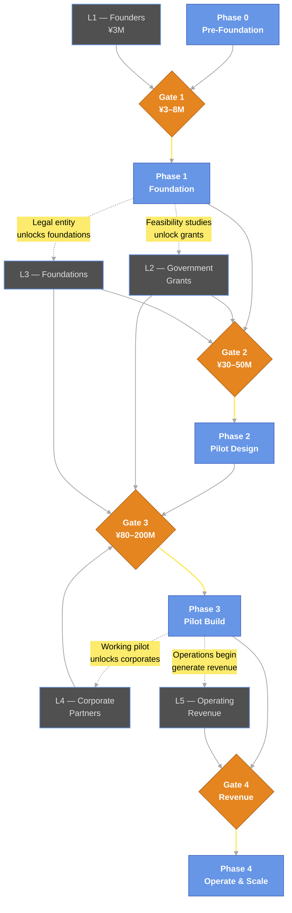

Version: v2.4 &nbsp;|&nbsp; Last modified: 2026-06-05

# Mitsue Project — Phases & Funding Flowchart

## Diagram 1 — Phase Spine with Funding Gates

```mermaid
%%{init: {'theme':'base','flowchart':{'htmlLabels':true},'themeVariables':{
  'background':'#404040',
  'primaryColor':'#6796e6','primaryTextColor':'#FFFFFF','primaryBorderColor':'#3655b5',
  'lineColor':'#A8A8A8','textColor':'#DEDEDE',
  'edgeLabelBackground':'#FCEB6C',
  'fontFamily':'Segoe UI, Helvetica, sans-serif'
}}}%%
flowchart LR
    P0["Phase 0<br/>Pre-Foundation<br/>M 1–3"]
    P1["Phase 1<br/>Foundation<br/>M 4–9"]
    P2["Phase 2<br/>Pilot Design<br/>M 10–18"]
    P3["Phase 3<br/>Pilot Build<br/>M 19–30"]
    P4["Phase 4<br/>Operate &amp; Scale<br/>M 31+"]

    G1{"Gate 1<br/>¥3–8M"}
    G2{"Gate 2<br/>¥30–50M"}
    G3{"Gate 3<br/>¥120–290M"}
    G4{"Gate 4<br/>Revenue<br/>online?"}

    H1["Hold &amp; Re-pitch"]
    H2["Hold / Descope"]
    H3["Stage Build"]

    P0 --> G1
    G1 -->|Pass| P1
    P1 --> G2
    G2 -->|Pass| P2
    P2 --> G3
    G3 -->|Pass| P3
    P3 --> G4
    G4 -->|Yes| P4

    G1 -->|Short| H1 -.-> G1
    G2 -->|Short| H2 -.-> G2
    G3 -->|Short| H3 -.-> G3
    G4 -->|Partial| P3

    classDef phase fill:#6796e6,stroke:#3655b5,stroke-width:1px,color:#FFFFFF,font-weight:bold
    classDef gate  fill:#e58520,stroke:#A85C10,stroke-width:1px,color:#FFFFFF,font-weight:bold
    classDef hold  fill:#353535,stroke:#FCEB6C,stroke-width:1px,color:#DEDEDE,stroke-dasharray:4 3
    class P0,P1,P2,P3,P4 phase
    class G1,G2,G3,G4 gate
    class H1,H2,H3 hold

    linkStyle default stroke:#A8A8A8,stroke-width:1.4px,color:#000000
    linkStyle 1,3,5,7 stroke:#FCEB6C,stroke-width:2.5px,color:#000000
```

---

## Diagram 2 — Funding Sources Feeding Each Gate

```mermaid
%%{init: {'theme':'base','themeVariables':{
  'background':'#404040',
  'primaryColor':'#6796e6','primaryTextColor':'#FFFFFF','primaryBorderColor':'#3655b5',
  'lineColor':'#A8A8A8','textColor':'#DEDEDE',
  'fontFamily':'Segoe UI, Helvetica, sans-serif',
  'edgeLabelBackground':'#FCEB6C'
}}}%%
flowchart TB
    P0["Phase 0<br/>Pre-Foundation"] --> G1{"Gate 1<br/>¥3–8M"}
    G1 --> P1["Phase 1<br/>Foundation"] --> G2{"Gate 2<br/>¥30–50M"}
    G2 --> P2["Phase 2<br/>Pilot Design"] --> G3{"Gate 3<br/>¥80–200M"}
    G3 --> P3["Phase 3<br/>Pilot Build"] --> G4{"Gate 4<br/>Revenue"}
    G4 --> P4["Phase 4<br/>Operate &amp; Scale"]

    F1["L1 — Founders<br/>¥3M"]
    F2["L2 — Government<br/>Grants"]
    F3["L3 — Foundations"]
    F4["L4 — Corporate<br/>Partners"]
    F5["L5 — Operating<br/>Revenue"]

    F1 --> G1
    F2 --> G2
    F3 --> G2
    F2 --> G3
    F3 --> G3
    F4 --> G3
    F5 --> G4

    P1 -.->|Feasibility studies<br/>unlock grants| F2
    P1 -.->|Legal entity<br/>unlocks foundations| F3
    P3 -.->|Working pilot<br/>unlocks corporates| F4
    P3 -.->|Operations begin<br/>generate revenue| F5

    classDef phase fill:#6796e6,stroke:#3655b5,stroke-width:1px,color:#FFFFFF,font-weight:bold
    classDef gate  fill:#e58520,stroke:#A85C10,stroke-width:1px,color:#FFFFFF,font-weight:bold
    classDef fund  fill:#505050,stroke:#6796e6,stroke-width:1.4px,color:#DEDEDE
    class P0,P1,P2,P3,P4 phase
    class G1,G2,G3,G4 gate
    class F1,F2,F3,F4,F5 fund

    linkStyle default stroke:#A8A8A8,stroke-width:1.4px,color:#000000
    linkStyle 1,3,5,7 stroke:#FCEB6C,stroke-width:2.5px,color:#000000
```

---

## Legend

| Shape / Colour | Meaning |
|---|---|
| **Light-blue box** (`#6796e6`) | Project phase — what gets done |
| **Orange diamond** (`#e58520`) | Funding gate — checkpoint between phases |
| **Slate box, light-blue border** (`#505050` / `#6796e6`) | Funding source / layer |
| **Dark dashed box, yellow border** | Hold or descope action when a gate fails |
| **Solid arrow** | Sequential flow / funding inflow |
| **Dotted arrow** | Feedback loop — phase deliverables unlock the next funding layer |

## How to read it

1. **Read the top row left-to-right** — that is the project's forward path through the five phases.
2. **Yellow diamonds are decision gates.** Each one asks: *"Have we secured enough funding to begin the next phase?"* If yes → proceed; if short → loop into a grey hold/descope box and re-pitch.
3. **The bottom row is the funding stack.** Arrows go *upward* into the gate that each funding source unlocks.
4. **Dotted arrows close the loop.** Completing a phase produces deliverables (feasibility studies, legal entity, working pilot) that themselves *unlock the next layer* of funding. This is the engine of the project.

---

---

## Funding Stack — Current Position (Baseline Rev 1, May 2026)

| Funding Layer | Source | Amount (¥M) |
|---|---|---|
| L1 — Founders | Founder capital (Rob Oudendijk) | ¥6M |
| L2 — Government Grants | National + prefectural + municipal grants | ¥115M |
| L3 — Foundations | Philanthropic foundations | ¥33M |
| L4 — Corporate Partners | Corporate sustainability / CSR | ¥35M |
| L5 — Operating Revenue | Early data center, biomass/solar energy, and EV revenue | ¥3M |
| **Total Raised / Committed** | | **¥192M** |
| | | |
| **BAC (PMB)** | Project budget baseline | **¥220M** |
| **Management Reserve** | Board-controlled reserve | ¥25M |
| **Total Project Budget** | | **¥245M** |
| | | |
| **Funding Gap vs BAC** | Additional funding required to meet BAC | **¥28M** |
| **Funding Gap vs Total Budget** | Additional funding required including MR | **¥53M** |

> **Note:** The ¥28M–¥53M funding gap is to be closed through additional government grants, new corporate partnerships, or bridge financing secured during Phase 2 (M10–M18). The funding stack above reflects commitments and realistic pipeline as of May 2026 — it is not a target to be artificially inflated. The gap is shown explicitly because stakeholders deserve an honest picture.

---

*Derived from `mitsue_implementation_plan.md` — May 2026*
