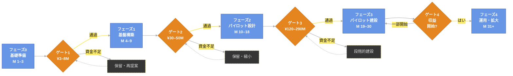
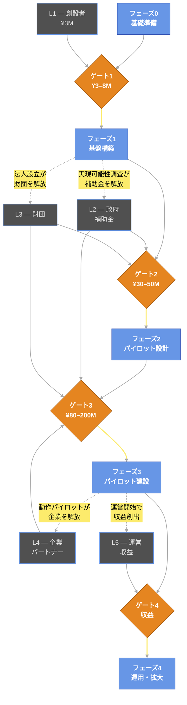

バージョン: v2.0 (Baseline Rev 1) &nbsp;|&nbsp; 最終更新: 2026-05-18

# 三津江プロジェクト — フェーズ・資金調達フローチャート

## 図1 — フェーズ構造と資金調達ゲート

---

## 図2 — 各ゲートへの資金調達ソース

---

## 凡例

| 形状・色 | 意味 |
|---|---|
| **水色ボックス** (`#6796e6`) | プロジェクトフェーズ — 実施内容 |
| **オレンジ色ひし形** (`#e58520`) | 資金調達ゲート — フェーズ間のチェックポイント |
| **スレートボックス・水色ボーダー** (`#505050` / `#6796e6`) | 資金調達ソース・レイヤー |
| **暗いダッシュボックス・黄色ボーダー** | ゲート不通過時の保留・縮小アクション |
| **実線矢印** | 順次フロー / 資金流入 |
| **点線矢印** | フィードバックループ — フェーズ成果物が次の資金レイヤーを解放 |

## 読み方

1. **上段を左から右へ読む** — これがプロジェクトの5フェーズを通じた前進パスです。
2. **黄色ひし形は判断ゲートです。** 各ゲートは「次のフェーズを開始するのに十分な資金を確保できたか？」を問います。通過 → 前進。資金不足 → 灰色の保留・縮小ボックスに入り、再提案します。
3. **下段は資金調達スタックです。** 矢印は各資金ソースが解放するゲートに向かって上方向に伸びます。
4. **点線矢印がループを閉じます。** フェーズを完了すると成果物（実現可能性調査、法人設立、動作パイロット）が生まれ、それ自体が次の資金レイヤーを解放します。これがプロジェクトのエンジンです。

---

---

## 資金調達スタック — 現状（Baseline Rev 1、2026年5月）

| 資金レイヤー | 調達元 | 金額（¥M） |
|---|---|---|
| L1 — 設立者 | 設立者出資（Rob Oudendijk） | ¥6M |
| L2 — 政府補助金 | 国・県・市町村補助金 | ¥115M |
| L3 — 財団 | 慈善財団 | ¥33M |
| L4 — 企業パートナー | 企業サステナビリティ・CSR | ¥35M |
| L5 — 事業収益 | データセンター・EV充電初期収益 | ¥3M |
| **調達済み・確約合計** | | **¥192M** |
| | | |
| **BAC（PMB）** | プロジェクト予算ベースライン | **¥220M** |
| **マネジメント予備費** | 理事会管理予備費 | ¥25M |
| **総プロジェクト予算** | | **¥245M** |
| | | |
| **BAC対資金不足額** | BAC充足に必要な追加調達額 | **¥28M** |
| **総予算対資金不足額** | 予備費含む充足に必要な追加調達額 | **¥53M** |

> **注記：** ¥28M〜¥53Mの資金不足は、フェーズ2（M10〜M18）において追加の政府補助金・新規企業提携・つなぎ融資により補填する計画です。上記の資金調達スタックは、2026年5月時点の確約・見込みを反映したものです。ステークホルダーへの透明性確保のため、不足額は明示しています。数字を人為的に嵩上げすることはいたしません。

---

*`mitsue_implementation_plan_jp.md` より引用 — 2026年5月*
