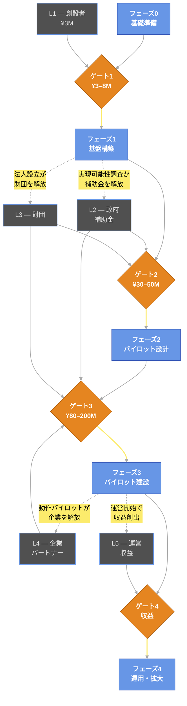

PROJECT DOCUMENT

<h1 style="font-size:28pt; font-weight:700; margin:0 0 2mm; border-bottom:1px solid #eee; padding-bottom:2mm;">Mitsue-kun Project</h1>

三津江プロジェクト — フェーズ・資金調達フローチャート

<table style="width:100%; border-collapse:collapse; font-size:9pt;">
<tr><td style="padding:3mm 4mm; border:1px solid #ccc; font-weight:bold; width:30%;">Version</td><td style="padding:3mm 4mm; border:1px solid #ccc;">v2.3</td></tr>
<tr><td style="padding:3mm 4mm; border:1px solid #ccc; font-weight:bold;">Date</td><td style="padding:3mm 4mm; border:1px solid #ccc;">2026-07-03</td></tr>
<tr><td style="padding:3mm 4mm; border:1px solid #ccc; font-weight:bold;">Author</td><td style="padding:3mm 4mm; border:1px solid #ccc;">Rob Oudendijk</td></tr>
</table>

# 三津江プロジェクト — フェーズ・資金調達フローチャート

> **スケジュール注記（2026-07-03）：** フェーズの日付は、現行の正式スケジュールである稼働中のOpenProjectガントチャートを反映しています。当初の2026年4月起点の月次計画（P0 1〜3か月目 … P3 19〜30か月目）より遅れています。コスト基準の再同期はEVMベースラインRev 2（2026年12月予定）の作業です。

## 図1 — フェーズ構造と資金調達ゲート

```mermaid
%%{init: {'theme':'base','flowchart':{'htmlLabels':true},'themeVariables':{
  'background':'#404040',
  'primaryColor':'#6796e6','primaryTextColor':'#FFFFFF','primaryBorderColor':'#3655b5',
  'lineColor':'#A8A8A8','textColor':'#DEDEDE',
  'edgeLabelBackground':'#FCEB6C',
  'fontFamily':'Noto Sans JP, Yu Gothic, sans-serif'
}}}%%
flowchart LR
    P0["フェーズ0<br/>基礎準備<br/>2026年4月〜10月"]
    P1["フェーズ1<br/>基盤構築<br/>2026年10月〜2027年5月"]
    P2["フェーズ2<br/>パイロット設計<br/>2027年5月〜2028年5月"]
    P3["フェーズ3<br/>パイロット建設<br/>2028年5月〜2029年11月"]
    P4["フェーズ4<br/>運用・拡大<br/>2029年11月以降"]

    G1{"ゲート1<br/>¥3–8M"}
    G2{"ゲート2<br/>¥30–50M"}
    G3{"ゲート3<br/>¥120–290M"}
    G4{"ゲート4<br/>収益<br/>開始?"}

    H1["保留・再提案"]
    H2["保留・縮小"]
    H3["段階的建設"]

    P0 --> G1
    G1 -->|通過| P1
    P1 --> G2
    G2 -->|通過| P2
    P2 --> G3
    G3 -->|通過| P3
    P3 --> G4
    G4 -->|はい| P4

    G1 -->|資金不足| H1 -.-> G1
    G2 -->|資金不足| H2 -.-> G2
    G3 -->|資金不足| H3 -.-> G3
    G4 -->|一部開始| P3

    classDef phase fill:#6796e6,stroke:#3655b5,stroke-width:1px,color:#FFFFFF,font-weight:bold
    classDef gate  fill:#e58520,stroke:#A85C10,stroke-width:1px,color:#FFFFFF,font-weight:bold
    classDef hold  fill:#353535,stroke:#FCEB6C,stroke-width:1px,color:#DEDEDE,stroke-dasharray:4 3
    class P0,P1,P2,P3,P4 phase
    class G1,G2,G3,G4 gate
    class H1,H2,H3 hold

    linkStyle default stroke:#A8A8A8,stroke-width:1.4px,color:#000000
    linkStyle 1,3,5,7 stroke:#FCEB6C,stroke-width:2.5px,color:#000000
```

---

## 図2 — 各ゲートへの資金調達ソース

---

## 凡例

| 形状・色 | 意味 |
|---|---|
| **水色ボックス** (`#6796e6`) | プロジェクトフェーズ — 実施内容 |
| **オレンジ色ひし形** (`#e58520`) | 資金調達ゲート — フェーズ間のチェックポイント |
| **スレートボックス・水色ボーダー** (`#505050` / `#6796e6`) | 資金調達ソース・レイヤー |
| **暗いダッシュボックス・黄色ボーダー** | ゲート不通過時の保留・縮小アクション |
| **実線矢印** | 順次フロー / 資金流入 |
| **点線矢印** | フィードバックループ — フェーズ成果物が次の資金レイヤーを解放 |

## 読み方

1. **上段を左から右へ読む** — これがプロジェクトの5フェーズを通じた前進パスです。
2. **黄色ひし形は判断ゲートです。** 各ゲートは「次のフェーズを開始するのに十分な資金を確保できたか？」を問います。通過 → 前進。資金不足 → 灰色の保留・縮小ボックスに入り、再提案します。
3. **下段は資金調達スタックです。** 矢印は各資金ソースが解放するゲートに向かって上方向に伸びます。
4. **点線矢印がループを閉じます。** フェーズを完了すると成果物（実現可能性調査、法人設立、動作パイロット）が生まれ、それ自体が次の資金レイヤーを解放します。これがプロジェクトのエンジンです。

---

---

## 資金調達スタック — 現状（Baseline Rev 1、2026年5月）

| 資金レイヤー | 調達元 | 金額（¥M） |
|---|---|---|
| L1 — 設立者 | 設立者出資（Rob Oudendijk） | ¥6M |
| L2 — 政府補助金 | 国・県・市町村補助金 | ¥115M |
| L3 — 財団 | 慈善財団 | ¥33M |
| L4 — 企業パートナー | 企業サステナビリティ・CSR | ¥35M |
| L5 — 事業収益 | データセンター・バイオマス/太陽光エネルギー・EV充電の初期収益 | ¥3M |
| **調達済み・確約合計** | | **¥192M** |
| | | |
| **BAC（PMB）** | プロジェクト予算ベースライン | **¥220M** |
| **マネジメント予備費** | 理事会管理予備費 | ¥25M |
| **総プロジェクト予算** | | **¥245M** |
| | | |
| **BAC対資金不足額** | BAC充足に必要な追加調達額 | **¥28M** |
| **総予算対資金不足額** | 予備費含む充足に必要な追加調達額 | **¥53M** |

> **注記：** ¥28M〜¥53Mの資金不足は、フェーズ2（M10〜M18）において追加の政府補助金・新規企業提携・つなぎ融資により補填する計画です。上記の資金調達スタックは、2026年5月時点の確約・見込みを反映したものです。ステークホルダーへの透明性確保のため、不足額は明示しています。数字を人為的に嵩上げすることはいたしません。**このギャップを埋める具体的かつ名前のある道筋が、村主導の地域脱炭素移行・再エネ推進交付金（環境省、国の脱炭素資金ラダー第2段）である。補助率：太陽光・蓄電池・EV・自営線設備費の2/3〜3/4、官民連携を通じて村へ交付。フェーズ2〜3を対象とする。** 図2のL2（政府補助金）は、この自治体経由のルートを含む。ベースラインRev 2（M9、2026年12月予定）に確定交付金額を反映する。

> **出典：** 環境省 — 地域脱炭素移行・再エネ推進交付金: https://policies.env.go.jp/policy/roadmap/grants/ · 実施要領（補助率2/3・3/4の条件）: https://www.env.go.jp/content/900470616.pdf

---

*`mitsue_implementation_plan_jp.md` より引用 — 2026年5月*
