# Mitsue Project — Stakeholders & Relations

## Entity List

### Core Team
| Name | Role |
|---|---|
| Rob Oudendijk | Founder & Project Lead (Dutch, resident Sugano since 2012) |
| Japanese Co-founder | TBD — top priority hire; rural-credible, Japanese-speaking |
| Mitsue Project (御杖プロジェクト) | Primary project entity (一般社団法人 → NPO法人) |
| YR-Design | Rob's company; project affiliation |
| Safecast | Citizen science network; philosophical foundation & open-data model |

### Advisors
| Name | Role |
|---|---|
| Joi Ito | Former MIT Media Lab Director; tech & innovation; confirmed May 5 2026 |
| Ray Ozzie | Creator of Lotus Notes; former Microsoft CSA; confirmed May 5 2026 |

### Local Stakeholders
| Name | Role |
|---|---|
| Mitsue Village Mayor | Primary government contact |
| Mitsue Village Vice Mayor | Initial informal contact (met late 2025) |
| 自治会 Leaders (Sugano + hamlets) | Community associations; trust-building target |
| Private Mountain Landowners | Sugi forest owners; harvesting partnership targets |
| Local Forestry Group | Early consultation partner (met early 2026) |
| Mitsue Elementary School | Closed building; central project asset |

### Government — Local & Regional
| Name | Role |
|---|---|
| Mitsue Village Government | Primary stakeholder; letter of interest target |
| Nara Prefecture | Regional oversight; potential grant source |

### Government — National
| Name | Role |
|---|---|
| METI (経済産業省) | FIT/FIP registration; green tech subsidies; 電気事業法 licensing |
| NEDO | Renewable energy R&D grants |
| 林野庁 (Forestry Agency) | Forestry permits (伐採届出); forestry subsidies |
| Cabinet Office (内閣府) | 地方創生 regional revitalization grants |
| Legal Affairs Bureau (法務局) | Corporate registration |

### Diplomatic
| Name | Role |
|---|---|
| Sandra Pellegrom | Dutch Consul-General, Osaka; potential support letter; Dutch-JP bridge |
| Kingdom of the Netherlands | Rob's origin; diplomatic backing |

### Foundations
| Name | Tier | Role |
|---|---|---|
| Nippon Foundation (日本財団) | Primary | Social challenge grants; Asia's largest grantmaker |
| Japan Fund for Global Environment | Primary | Environmental conservation grants |
| Toyota Foundation | Secondary | Community & rural projects |
| MacArthur Foundation | Stretch | Through Joi Ito network |
| Rockefeller Foundation | Stretch | Through Joi Ito network |

### Japanese Corporates (potential partners)
| Name | Angle |
|---|---|
| NTT | Fiber connectivity; data center consultation (critical contact) |
| SoftBank | Data center partnership |
| Sumitomo Forestry (住友林業) | Forestry expertise & capital |
| Mitsui Bussan (三井物産) | Trading company; forestry supply chain |
| Hitachi | Industrial / infrastructure |

### Dutch Corporates (potential partners)
| Name | Angle |
|---|---|
| Philips | CSR; Dutch presence in Japan |
| ASML | CSR; Dutch presence in Japan |
| Royal HaskoningDHV | Water & infrastructure engineering |
| Arcadis | Sustainability & climate consulting |
| Heineken | CSR; Dutch presence in Japan |

### Legal & Professional Support (to hire)
| Role | Timing |
|---|---|
| 行政書士 (Administrative Scrivener) | Phase 0–1; permits, NPO setup, grants |
| 公認会計士 / 税理士 (Accountant / Tax) | Phase 1; accounting system, tax registration |
| 弁護士 (Lawyer) | Phase 1–2; landowner contracts |

---

## Relationship Flowchart

```mermaid
graph TD
    %% Core
    ROB["👤 Rob Oudendijk\nFounder & Lead"]
    COFOUND["👤 Japanese Co-founder\n(TBD — top priority)"]
    PROJ["🏗️ Mitsue Project\n御杖プロジェクト"]
    YR["🏢 YR-Design"]
    SAFECAST["🌐 Safecast\nOpen data model"]

    %% Advisors
    JOI["👤 Joi Ito\nMIT Media Lab"]
    RAY["👤 Ray Ozzie\nMicrosoft / Lotus"]

    %% Diplomatic
    CONSUL["👤 Sandra Pellegrom\nDutch Consul-General"]
    NL["🇳🇱 Kingdom of Netherlands"]

    %% Local
    MAYOR["👤 Village Mayor"]
    VMAYOR["👤 Vice Mayor"]
    JICHIKAI["👥 自治会 Leaders"]
    LANDOWNERS["👥 Private Landowners"]
    FORESTRY_LOCAL["👥 Local Forestry Group"]
    SCHOOL["🏫 Mitsue Elementary\n(closed school)"]

    %% Government
    subgraph GOV_LOCAL["Local & Regional Government"]
        VILLAGE_GOV["🏛️ Mitsue Village Govt"]
        NARA["🏛️ Nara Prefecture"]
    end

    subgraph GOV_NAT["National Government"]
        METI["🏛️ METI\nFIT/FIP · subsidies"]
        NEDO["🏛️ NEDO\nR&D grants"]
        RINSHO["🏛️ 林野庁\nForestry permits"]
        CABINET["🏛️ Cabinet Office\n地方創生 grants"]
        LEGAL_BUREAU["🏛️ Legal Affairs Bureau"]
    end

    %% Foundations
    subgraph FOUNDATIONS["Foundations"]
        NIPPON["🏦 Nippon Foundation"]
        JFGE["🏦 Japan Fund for\nGlobal Environment"]
        TOYOTA_F["🏦 Toyota Foundation"]
    end

    %% Corporates
    subgraph CORP_JP["Japanese Corporates"]
        NTT["🏢 NTT\nFiber · data center"]
        SOFTBANK["🏢 SoftBank"]
        SUMITOMO["🏢 Sumitomo Forestry"]
        MITSUI["🏢 Mitsui Bussan"]
    end

    subgraph CORP_NL["Dutch Corporates"]
        PHILIPS["🏢 Philips"]
        ASML["🏢 ASML"]
        RHDHV["🏢 Royal HaskoningDHV"]
        ARCADIS["🏢 Arcadis"]
    end

    %% Legal
    subgraph LEGAL_SUPPORT["Professional Support (to hire)"]
        GYOSEI["⚖️ 行政書士"]
        KAIKEI["⚖️ 公認会計士/税理士"]
        BENGOSHI["⚖️ 弁護士"]
    end

    %% ── Relations ──────────────────────────────────────────────────────────

    ROB -->|"co-founds"| PROJ
    COFOUND -->|"co-founds"| PROJ
    ROB -->|"affiliated with"| YR
    ROB -->|"core contributor"| SAFECAST
    SAFECAST -->|"inspires open-data model"| PROJ

    JOI -->|"advises"| PROJ
    RAY -->|"advises"| PROJ

    CONSUL -->|"potential support letter"| PROJ
    NL -->|"diplomatic backing"| CONSUL
    ROB -.->|"Dutch national\nseeks support from"| CONSUL

    ROB -->|"initial meeting (2025)"| VMAYOR
    VMAYOR -->|"gateway to"| MAYOR
    MAYOR -->|"formal approval"| VILLAGE_GOV
    VILLAGE_GOV -->|"letter of interest"| PROJ
    VILLAGE_GOV -->|"owns"| SCHOOL
    SCHOOL -->|"repurposed as\ndata center + hub"| PROJ
    JICHIKAI -->|"community buy-in"| PROJ
    LANDOWNERS -->|"sugi harvest\npartnership"| PROJ
    FORESTRY_LOCAL -->|"early consultation"| PROJ

    VILLAGE_GOV -->|"under"| NARA
    NARA -->|"regional grants"| PROJ
    LEGAL_BUREAU -->|"registers"| PROJ

    METI -->|"FIT/FIP · subsidies"| PROJ
    NEDO -->|"R&D grants"| PROJ
    RINSHO -->|"forestry permits\n+ subsidies"| PROJ
    CABINET -->|"地方創生 grants"| PROJ

    NIPPON -->|"social grants"| PROJ
    JFGE -->|"env. grants"| PROJ
    TOYOTA_F -->|"community grants"| PROJ
    JOI -.->|"network access to"| NIPPON

    NTT -->|"fiber + data center\nconsultation"| PROJ
    SOFTBANK -->|"data center partner"| PROJ
    SUMITOMO -->|"forestry expertise"| PROJ
    MITSUI -->|"supply chain"| PROJ

    PHILIPS -->|"CSR partner"| PROJ
    ASML -->|"CSR partner"| PROJ
    RHDHV -->|"engineering"| PROJ
    ARCADIS -->|"sustainability"| PROJ
    CONSUL -.->|"introduces\nDutch corporates"| PROJ

    GYOSEI -->|"permits + NPO setup"| PROJ
    KAIKEI -->|"accounting"| PROJ
    BENGOSHI -->|"landowner contracts"| PROJ
```

