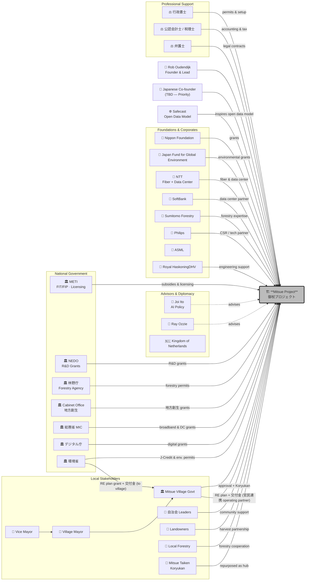

PROJECT DOCUMENT

<h1 style="font-size:28pt; font-weight:700; margin:0 0 2mm; border-bottom:1px solid #eee; padding-bottom:2mm;">Mitsue Project</h1>

Stakeholders & Relations

<table style="width:100%; border-collapse:collapse; font-size:9pt;">
<tr><td style="padding:3mm 4mm; border:1px solid #ccc; font-weight:bold; width:30%;">Version</td><td style="padding:3mm 4mm; border:1px solid #ccc;">v2.6</td></tr>
<tr><td style="padding:3mm 4mm; border:1px solid #ccc; font-weight:bold;">Date</td><td style="padding:3mm 4mm; border:1px solid #ccc;">2026-06-10</td></tr>
<tr><td style="padding:3mm 4mm; border:1px solid #ccc; font-weight:bold;">Author</td><td style="padding:3mm 4mm; border:1px solid #ccc;">Rob Oudendijk</td></tr>
</table>

# Mitsue Project — Stakeholders & Relations

## Entity List

### Core Team
| Name                              | Role                                                                |
| --------------------------------- | ------------------------------------------------------------------- |
| Rob Oudendijk                     | Founder & Project Lead (Dutch, resident Sugano since 2012)          |
| Japanese Co-founder               | TBD — top priority hire; rural-credible, Japanese-speaking          |
| Mitsue Project (御杖プロジェクト) | Primary project entity (一般社団法人 → NPO法人)                     |
| YR-Design                         | Rob's company; project affiliation                                  |
| Safecast                          | Citizen science network; philosophical foundation & open-data model |

### Advisors
| Name      | Role                                                                                                                                                                                                                                            |
| --------- | ----------------------------------------------------------------------------------------------------------------------------------------------------------------------------------------------------------------------------------------------- |
| Joi Ito              | Former MIT Media Lab Director; AI policy advisor to Japanese government; member of METI AI Strategy Council & Digital Agency advisory bodies; deep connections across Japanese tech, government, and philanthropy circles; confirmed May 5 2026 |
| Ray Ozzie            | Creator of Lotus Notes; former Microsoft CSA; confirmed May 5 2026                                                                                                                                                                              |
| San Poisson         | Project Manager                                                                                                                                                                                                                                 |
| Takuo Dome          | Professor Emeritus, Osaka University · Director, Inochi Forum; specializes in history of economics and social innovation; confirmed |

### Local Stakeholders
| Name                              | Role                                               |
| --------------------------------- | -------------------------------------------------- |
| Mitsue Village Mayor              | Primary government contact                         |
| Mitsue Village Vice Mayor         | Initial informal contact (met late 2025)           |
| 自治会 Leaders (Sugano + hamlets) | Community associations; trust-building target      |
| Private Mountain Landowners       | Sugi forest owners; harvesting partnership targets |
| Local Forestry Group              | Early consultation partner (met early 2026)        |
| Mitsue Taiken Koryukan            | Available community exchange center; leading candidate Phase 1 datacenter site (final choice confirmed in Phase 1) |

### Government — Local & Regional
| Name                      | Role                                           |
| ------------------------- | ---------------------------------------------- |
| Mitsue Village Government | Primary stakeholder; letter of interest target |
| Nara Prefecture           | Regional oversight; potential grant source     |

### Government — National (Grants, Permissions & Policy)

| Ministry / Agency                           | Grants / Funding                                       | Permissions / Regulation                                                   | Notes                                                                               |
| ------------------------------------------- | ------------------------------------------------------ | -------------------------------------------------------------------------- | ----------------------------------------------------------------------------------- |
| METI (経済産業省)                           | Green tech subsidies; data center incentives           | FIT/FIP registration; 電気事業法 (power generation licensing)              | Key funder for energy transition & AI infrastructure                                |
| NEDO                                        | Renewable energy R&D grants; rural energy resilience and EV infrastructure grants | —                                                                          | Arm of METI; major R&D grant source                                                 |
| 林野庁 (Forestry Agency)                    | Forestry subsidies; reforestation grants               | 伐採届出 (cutting notification); Forest Act compliance                     | Critical for forest restoration and legal timber sourcing                           |
| Cabinet Office (内閣府)                     | 地方創生 regional revitalization grants (¥5–50M)       | —                                                                          | Digital Garden City Nation Initiative policy driver                                 |
| 総務省 (MIC — Ministry of Internal Affairs) | Rural broadband subsidies; data center regional grants | Telecom regulation; municipal digital policy                               | Funds rural fiber; connected to Digital Garden City strategy                        |
| デジタル庁 (Digital Agency)                 | Digital transformation grants for rural areas          | Digital infrastructure standards                                           | Joi Ito has advisory connections here; aligned with project's rural digital mission |
| 環境省 (Ministry of Environment)            | Carbon credit support; **地域脱炭素移行・再エネ推進交付金 (2/3–3/4, via village)**; planning-support grant (funded the village RE plan) | J-Credit certification; environmental impact assessment (環境アセスメント) | Governs J-Credit scheme for forest carbon offsets. **Funds the village's RE plan & 交付金 channel: village = grant recipient, project = 官民連携 operating partner** |
| JST (Japan Science and Technology Agency)   | R&D grants for green tech & AI                         | —                                                                          | Potential Phase 2–3 R&D co-funding                                                  |
| 農業委員会 (Agricultural Commission)        | —                                                      | Land use permits if agricultural land involved                             | Local body; Nara Prefecture jurisdiction                                            |
| Legal Affairs Bureau (法務局)               | —                                                      | Corporate registration (一般社団法人)                                      | One-time registration                                                               |

### Diplomatic
| Name                       | Role                             |
| -------------------------- | -------------------------------- |
| Kingdom of the Netherlands | Rob's origin; diplomatic backing |

### Foundations
| Name                              | Tier      | Role                                               |
| --------------------------------- | --------- | -------------------------------------------------- |
| Nippon Foundation (日本財団)      | Primary   | Social challenge grants; Asia's largest grantmaker |
| Japan Fund for Global Environment | Primary   | Environmental conservation grants                  |
| Toyota Foundation                 | Secondary | Community & rural projects                         |
| MacArthur Foundation              | Stretch   | Through Joi Ito network                            |
| Rockefeller Foundation            | Stretch   | Through Joi Ito network                            |

### Japanese Corporates (potential partners)
| Name                         | Angle                                                           |
| ---------------------------- | --------------------------------------------------------------- |
| NTT                          | Fiber connectivity; data center consultation (critical contact) |
| SoftBank                     | Data center partnership                                         |
| Sumitomo Forestry (住友林業) | Forestry expertise & capital                                    |
| Mitsui Bussan (三井物産)     | Trading company; forestry supply chain                          |
| Hitachi                      | Industrial / infrastructure                                     |

### Dutch Corporates (potential partners)
| Name               | Angle                               |
| ------------------ | ----------------------------------- |
| Philips            | CSR; Dutch presence in Japan        |
| ASML               | CSR; Dutch presence in Japan        |
| Royal HaskoningDHV | Water & infrastructure engineering  |
| Arcadis            | Sustainability & climate consulting |
| Heineken           | CSR; Dutch presence in Japan        |

### Legal & Professional Support (to hire)
| Role                                   | Timing                                       |
| -------------------------------------- | -------------------------------------------- |
| 行政書士 (Administrative Scrivener)    | Phase 0–1; permits, NPO setup, grants        |
| 公認会計士 / 税理士 (Accountant / Tax) | Phase 1; accounting system, tax registration |
| 弁護士 (Lawyer)                        | Phase 1–2; landowner contracts               |

---

---

## Decisions Required of Each Stakeholder

The following table makes explicit what each key stakeholder must actually decide — and when — for the project to advance.

| Stakeholder | Decision(s) required | When |
|---|---|---|
| Village government | Koryukan use / lease terms; endorse project as 官民連携 operating partner for the 交付金; co-apply for 地域脱炭素移行・再エネ推進交付金; issue letter of interest | Phase 0–1 |
| Mountain landowners | Sugi harvesting terms and fair compensation; participation in restoration programme | Phase 1–2 |
| Advisory board (Ito, Ozzie, Dome) | Confirm written commitments (even informal); agree on time commitment and engagement scope | Phase 0 |
| JP co-founder (TBD) | Commit to the project; agree role, time commitment, and compensation terms in Founder Agreement | Phase 0 (Gate 1 trigger if unresolved) |
| Funders / grantmakers | Award decisions at each gate (G1 ¥3–8M; G2 ¥30–50M; G3 ¥120–290M) | Phase 1–3 |
| Rob Oudendijk | Confirm continued availability and Japan residency; execute Founder Agreement; trigger Gate 1 hold if JP co-founder not secured | Phase 0 |

---

## Relationship Flowchart

```mermaid
%%{init: {'flowchart': {'nodeSpacing': 25, 'rankSpacing': 35, 'curve': 'basis'}}}%%
flowchart LR
    %% ==================== LEFT COLUMN - INPUTS ====================

    ROB["👤 Rob Oudendijk\nFounder & Lead"]
    COFOUND["👤 Japanese Co-founder\n(TBD — Priority)"]

    subgraph Advisors["Advisors & Diplomacy"]
        JOI["👤 Joi Ito\nAI Policy"]
        RAY["👤 Ray Ozzie"]
        NL["🇳🇱 Kingdom of Netherlands"]
    end

    subgraph Local["Local Stakeholders"]
        VILLAGE["🏛️ Mitsue Village Govt"]
        MAYOR["👤 Village Mayor"]
        VMAYOR["👤 Vice Mayor"]
        JICHIKAI["👥 自治会 Leaders"]
        LANDOWNERS["👥 Landowners"]
        FORESTRY["👥 Local Forestry"]
        SCHOOL["🏫 Mitsue Taiken\nKoryukan"]
    end

    subgraph National["National Government"]
        METI["🏛️ METI\nFIT/FIP · Licensing"]
        NEDO["🏛️ NEDO\nR&D Grants"]
        RINSHO["🏛️ 林野庁\nForestry Agency"]
        CABINET["🏛️ Cabinet Office\n地方創生"]
        MIC["🏛️ 総務省 MIC"]
        DIGITAL["🏛️ デジタル庁"]
        ENV["🏛️ 環境省"]
    end

    subgraph Partners["Foundations & Corporates"]
        NIPPON["🏦 Nippon Foundation"]
        JFGE["🏦 Japan Fund for Global Environment"]
        NTT["🏢 NTT\nFiber + Data Center"]
        SOFTBANK["🏢 SoftBank"]
        SUMITOMO["🏢 Sumitomo Forestry"]
        PHILIPS["🏢 Philips"]
        ASML["🏢 ASML"]
        RHDHV["🏢 Royal HaskoningDHV"]
    end

    subgraph Support["Professional Support"]
        GYOSEI["⚖️ 行政書士"]
        KAIKEI["⚖️ 公認会計士 / 税理士"]
        BENGOSHI["⚖️ 弁護士"]
    end

    SAFECAST["🌐 Safecast\nOpen Data Model"]

    %% ==================== CONNECTIONS ====================

    ROB --> PROJ
    COFOUND --> PROJ
    SAFECAST -->|"inspires open data model"| PROJ

    JOI -.->|"advises"| PROJ
    RAY -.->|"advises"| PROJ
    VILLAGE -->|"approval + Koryukan"| PROJ
    VILLAGE -->|"RE plan + 交付金 (官民連携 operating partner)"| PROJ
    MAYOR --> VILLAGE
    VMAYOR --> MAYOR
    JICHIKAI -->|"community support"| PROJ
    LANDOWNERS -->|"harvest partnership"| PROJ
    FORESTRY -->|"forestry cooperation"| PROJ
    SCHOOL -->|"repurposed as hub"| PROJ

    METI -->|"subsidies & licensing"| PROJ
    NEDO -->|"R&D grants"| PROJ
    RINSHO -->|"forestry permits"| PROJ
    CABINET -->|"地方創生 grants"| PROJ
    MIC -->|"broadband & DC grants"| PROJ
    DIGITAL -->|"digital grants"| PROJ
    ENV -->|"J-Credit & env. permits"| PROJ
    ENV -->|"RE plan grant + 交付金 (to village)"| VILLAGE

    NIPPON -->|"grants"| PROJ
    JFGE -->|"environmental grants"| PROJ
    NTT -->|"fiber & data center"| PROJ
    SOFTBANK -->|"data center partner"| PROJ
    SUMITOMO -->|"forestry expertise"| PROJ
    PHILIPS -->|"CSR / tech partner"| PROJ
    RHDHV -->|"engineering support"| PROJ

    GYOSEI -->|"permits & setup"| PROJ
    KAIKEI -->|"accounting & tax"| PROJ
    BENGOSHI -->|"legal contracts"| PROJ

    %% ==================== MAIN PROJECT - RIGHT CENTER ====================
    PROJ["🏗️ **Mitsue Project**\n御杖プロジェクト"]

    classDef main fill:#bbbbbb, stroke:#202020, stroke-width:3px, rx:3, ry3
    class PROJ main
```
