# 御杖プロジェクト — ステークホルダーと関係図

## 関係者一覧

### コアチーム
| 名前 | 役割 |
|---|---|
| ロブ・アウデンダイク (Rob Oudendijk) | 創設者・プロジェクトリード（オランダ人、2012年より菅野在住） |
| 日本人共同創設者 | 未定 — 最優先採用。地域に信頼される日本語話者 |
| 御杖プロジェクト | 主体法人（一般社団法人 → NPO法人） |
| YR-Design | ロブの会社。プロジェクトの所属母体 |
| Safecast | 市民科学ネットワーク。オープンデータモデルの哲学的基盤 |

### アドバイザー
| 名前 | 役割 |
|---|---|
| 伊藤穰一（Joi Ito） | 元MITメディアラボ所長。AI政策アドバイザー（経済産業省AIストラテジー会議、デジタル庁諮問委員）。日本の技術・政府・財団界に幅広いネットワークを持つ。2026年5月5日確定 |
| レイ・オジー（Ray Ozzie） | Lotus Notes開発者。元Microsoft最高ソフトウェアアーキテクト。2026年5月5日確定 |

### 地域ステークホルダー
| 名前 | 役割 |
|---|---|
| 御杖村長 | 主要な行政窓口 |
| 御杖村副村長 | 最初の非公式接触（2025年末面談済み） |
| 自治会リーダー（菅野・周辺集落） | 地域住民組織。信頼関係構築の重要対象 |
| 民間山林地主 | 杉林所有者。伐採パートナーシップの交渉対象 |
| 地元林業グループ | 初期協議パートナー（2026年初頭面談済み） |
| 御杖小学校（廃校） | プロジェクトの中核資産。データセンター・コミュニティ拠点として活用 |

### 行政 — 地域・都道府県
| 名前 | 役割 |
|---|---|
| 御杖村役場 | 主要ステークホルダー。村の協力意向書の取得対象 |
| 奈良県 | 地域監督機関。県補助金の潜在的な提供元 |

### 行政 — 国（補助金・許認可・政策）

| 省庁・機関 | 補助金・資金調達 | 許認可・規制 | 備考 |
|---|---|---|---|
| 経済産業省（METI） | グリーン技術補助金、データセンター誘致補助金 | FIT/FIP登録、電気事業法（発電ライセンス） | エネルギー転換とAIインフラの主要資金源。伊藤穰一がAI戦略会議に関与 |
| NEDO（新エネルギー・産業技術総合開発機構） | 再生可能エネルギーR&D補助金、バイオマス技術助成 | — | 経産省の外郭団体。主要なR&D資金源 |
| 林野庁 | 林業補助金、再造林助成 | 伐採届出（森林法）、Forest Act対応 | バイオマス燃料の合法的調達に不可欠 |
| 内閣府（地方創生） | 地方創生関係交付金（5億〜50億円規模） | — | デジタル田園都市国家構想の推進母体 |
| 総務省（MIC） | 農村ブロードバンド補助金、地方データセンター誘致交付金 | 通信規制、市区町村デジタル政策 | 農村光ファイバー整備に資金拠出。デジタル田園都市戦略と連動 |
| デジタル庁 | 農村デジタルトランスフォーメーション補助金 | デジタルインフラ標準 | 伊藤穰一が諮問委員として関与。プロジェクトの農村デジタル化ミッションと合致 |
| 環境省 | — | J-Credit認証（森林カーボンオフセット）、環境アセスメント | J-Credit制度の監督官庁 |
| JST（科学技術振興機構） | グリーンテック・AIのR&D助成 | — | フェーズ2〜3での共同資金調達候補 |
| 農業委員会 | — | 農地が関係する場合の土地利用許可 | 奈良県管轄の地域組織 |
| 法務局 | — | 一般社団法人の法人登記 | 設立時の一回限りの手続き |

### 外交
| 名前 | 役割 |
|---|---|
| サンドラ・ペレグロム（Sandra Pellegrom） | 在大阪オランダ王国総領事。支援書簡の取得対象。オランダ・日本間の架け橋 |
| オランダ王国 | ロブの出身国。外交的後ろ盾 |

### 財団・助成機関
| 名前 | 優先度 | 役割 |
|---|---|---|
| 日本財団 | 主要 | 社会課題助成。アジア最大級の助成機関 |
| 地球環境基金（JFGE） | 主要 | 環境保全助成 |
| トヨタ財団 | 次点 | コミュニティ・農村プロジェクト助成 |
| マッカーサー財団 | 発展的候補 | 伊藤穰一のネットワーク経由 |
| ロックフェラー財団 | 発展的候補 | 伊藤穰一のネットワーク経由 |

### 日本企業（パートナー候補）
| 名前 | 連携の切り口 |
|---|---|
| NTT（日本電信電話） | 光ファイバー接続、データセンター協議（最重要接触先） |
| ソフトバンク | データセンターパートナーシップ |
| 住友林業 | 林業専門知識と資本 |
| 三井物産 | 総合商社。林業サプライチェーン |
| 日立製作所 | 産業・インフラパートナー |

### オランダ企業（パートナー候補）
| 名前 | 連携の切り口 |
|---|---|
| フィリップス（Philips） | CSR、日本でのオランダ企業プレゼンス |
| ASML | CSR、日本でのオランダ企業プレゼンス |
| ロイヤル・ハスコニング DHV | 水・インフラ工学 |
| アルカディス（Arcadis） | サステナビリティ・気候コンサルティング |
| ハイネケン（Heineken） | CSR、日本でのオランダ企業プレゼンス |

### 法務・専門家サポート（採用予定）
| 役割 | タイミング |
|---|---|
| 行政書士 | フェーズ0〜1：各種許認可、NPO設立、補助金申請（奈良県内が望ましい） |
| 公認会計士 / 税理士 | フェーズ1：会計システム構築、税務登録 |
| 弁護士 | フェーズ1〜2：地主との契約書作成 |

---

## 関係図（Mermaid）

```mermaid
graph TD
    %% コア
    ROB["👤 ロブ・アウデンダイク\n創設者・プロジェクトリード"]
    COFOUND["👤 日本人共同創設者\n（未定 — 最優先）"]
    PROJ["🏗️ 御杖プロジェクト\n一般社団法人 → NPO法人"]
    YR["🏢 YR-Design"]
    SAFECAST["🌐 Safecast\nオープンデータモデル"]

    %% アドバイザー
    JOI["👤 伊藤穰一\nAI政策 · MITメディアラボ · 日本政府"]
    RAY["👤 レイ・オジー\nMicrosoft / Lotus Notes"]

    %% 外交
    CONSUL["👤 サンドラ・ペレグロム\n在大阪オランダ総領事"]
    NL["🇳🇱 オランダ王国"]

    %% 地域
    MAYOR["👤 御杖村長"]
    VMAYOR["👤 副村長"]
    JICHIKAI["👥 自治会リーダー\n菅野・周辺集落"]
    LANDOWNERS["👥 民間山林地主"]
    FORESTRY_LOCAL["👥 地元林業グループ"]
    SCHOOL["🏫 御杖小学校\n（廃校）"]

    %% 行政
    subgraph GOV_LOCAL["地域・都道府県行政"]
        VILLAGE_GOV["🏛️ 御杖村役場"]
        NARA["🏛️ 奈良県"]
    end

    subgraph GOV_NAT["国 — 補助金・許認可・政策"]
        METI["🏛️ 経済産業省（METI）\nFIT/FIP · グリーン補助金\n電気事業法"]
        NEDO["🏛️ NEDO\n再エネR&D補助金"]
        RINSHO["🏛️ 林野庁\n伐採届出 · 林業補助金"]
        CABINET["🏛️ 内閣府\n地方創生交付金\nデジタル田園都市"]
        MIC["🏛️ 総務省\n農村ブロードバンド補助金\n通信規制"]
        DIGITAL["🏛️ デジタル庁\n農村DX補助金"]
        ENV["🏛️ 環境省\nJ-Credit認証\n環境アセスメント"]
        JST["🏛️ JST\nR&D助成（フェーズ2〜3）"]
        LEGAL_BUREAU["🏛️ 法務局\n法人登記"]
    end

    %% 財団
    subgraph FOUNDATIONS["財団・助成機関"]
        NIPPON["🏦 日本財団"]
        JFGE["🏦 地球環境基金"]
        TOYOTA_F["🏦 トヨタ財団"]
    end

    %% 日本企業
    subgraph CORP_JP["日本企業"]
        NTT["🏢 NTT\n光ファイバー · データセンター"]
        SOFTBANK["🏢 ソフトバンク"]
        SUMITOMO["🏢 住友林業"]
        MITSUI["🏢 三井物産"]
    end

    %% オランダ企業
    subgraph CORP_NL["オランダ企業"]
        PHILIPS["🏢 フィリップス"]
        ASML["🏢 ASML"]
        RHDHV["🏢 ロイヤル・ハスコニングDHV"]
        ARCADIS["🏢 アルカディス"]
    end

    %% 専門家
    subgraph LEGAL_SUPPORT["法務・専門家（採用予定）"]
        GYOSEI["⚖️ 行政書士"]
        KAIKEI["⚖️ 公認会計士/税理士"]
        BENGOSHI["⚖️ 弁護士"]
    end

    %% ── 関係線 ──────────────────────────────────────────────────────────

    ROB -->|"共同創設"| PROJ
    COFOUND -->|"共同創設"| PROJ
    ROB -->|"所属"| YR
    ROB -->|"中核貢献者"| SAFECAST
    SAFECAST -->|"オープンデータ\nモデルに影響"| PROJ

    JOI -->|"顧問"| PROJ
    RAY -->|"顧問"| PROJ
    JOI -.->|"AI政策顧問"| METI
    JOI -.->|"諮問委員"| DIGITAL

    NL -->|"外交的後ろ盾"| CONSUL
    CONSUL -->|"支援書簡"| PROJ
    ROB -.->|"オランダ国籍\n支援要請"| CONSUL
    CONSUL -.->|"オランダ企業\n紹介"| PHILIPS

    ROB -->|"初回面談（2025年）"| VMAYOR
    VMAYOR -->|"村長へのルート"| MAYOR
    MAYOR -->|"正式承認"| VILLAGE_GOV
    VILLAGE_GOV -->|"協力意向書"| PROJ
    VILLAGE_GOV -->|"所有"| SCHOOL
    SCHOOL -->|"データセンター\n拠点として活用"| PROJ
    JICHIKAI -->|"地域の合意形成"| PROJ
    LANDOWNERS -->|"杉伐採\nパートナーシップ"| PROJ
    FORESTRY_LOCAL -->|"初期協議"| PROJ

    VILLAGE_GOV -->|"管轄下"| NARA
    NARA -->|"地域補助金"| PROJ
    LEGAL_BUREAU -->|"法人登記"| PROJ

    METI -->|"FIT/FIP · 補助金"| PROJ
    NEDO -->|"R&D補助金"| PROJ
    RINSHO -->|"伐採許可\n+ 林業補助金"| PROJ
    CABINET -->|"地方創生\n交付金"| PROJ
    MIC -->|"農村ブロードバンド\nデータセンター補助金"| PROJ
    DIGITAL -->|"農村DX補助金"| PROJ
    ENV -->|"J-Credit認証\n環境許認可"| PROJ
    JST -->|"R&D助成"| PROJ

    NIPPON -->|"社会課題助成"| PROJ
    JFGE -->|"環境助成"| PROJ
    TOYOTA_F -->|"コミュニティ助成"| PROJ
    JOI -.->|"ネットワーク\nアクセス"| NIPPON

    NTT -->|"光ファイバー\nデータセンター"| PROJ
    SOFTBANK -->|"データセンター\nパートナー"| PROJ
    SUMITOMO -->|"林業専門知識"| PROJ
    MITSUI -->|"サプライチェーン"| PROJ

    PHILIPS -->|"CSRパートナー"| PROJ
    ASML -->|"CSRパートナー"| PROJ
    RHDHV -->|"インフラ工学"| PROJ
    ARCADIS -->|"サステナビリティ"| PROJ

    GYOSEI -->|"許認可\nNPO設立"| PROJ
    KAIKEI -->|"会計"| PROJ
    BENGOSHI -->|"地主との\n契約"| PROJ
```

