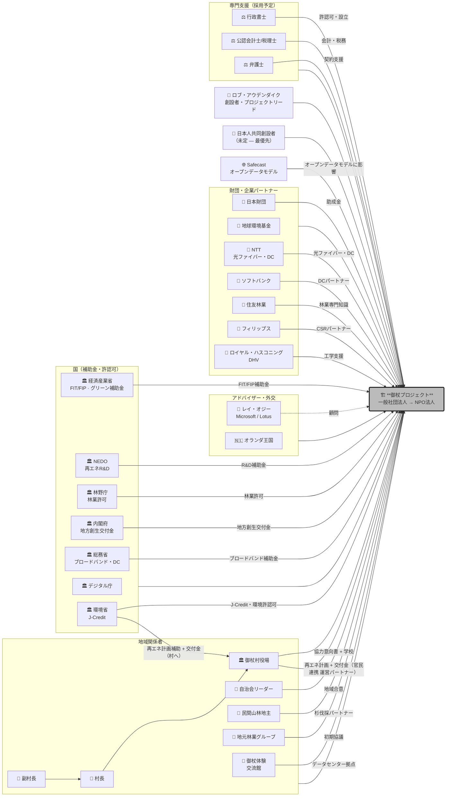

PROJECT DOCUMENT

<h1 style="font-size:28pt; font-weight:700; margin:0 0 2mm; border-bottom:1px solid #eee; padding-bottom:2mm;">Mitsue Project</h1>

御杖プロジェクト — ステークホルダーと関係図

<table style="width:100%; border-collapse:collapse; font-size:9pt;">
<tr><td style="padding:3mm 4mm; border:1px solid #ccc; font-weight:bold; width:30%;">Version</td><td style="padding:3mm 4mm; border:1px solid #ccc;">v2.8</td></tr>
<tr><td style="padding:3mm 4mm; border:1px solid #ccc; font-weight:bold;">Date</td><td style="padding:3mm 4mm; border:1px solid #ccc;">2026-06-17</td></tr>
<tr><td style="padding:3mm 4mm; border:1px solid #ccc; font-weight:bold;">Author</td><td style="padding:3mm 4mm; border:1px solid #ccc;">Rob Oudendijk</td></tr>
</table>

# ステークホルダーと関係図

## 関係者一覧

### コアチーム
| 名前                                 | 役割                                                         |
| ------------------------------------ | ------------------------------------------------------------ |
| ロブ・アウデンダイク (Rob Oudendijk) | 創設者・プロジェクトリード（オランダ人、2012年より菅野在住） |
| 日本人共同創設者                     | 未定 — 最優先採用。地域に信頼される日本語話者                |
| 御杖プロジェクト                     | 主体法人（一般社団法人 → NPO法人）                           |
| YR-Design                            | ロブの会社。プロジェクトの所属母体                           |
| Safecast                             | 市民科学ネットワーク。オープンデータモデルの哲学的基盤       |

### アドバイザー
| 名前                      | 役割                                                                                                                                                                |
| ------------------------- | ------------------------------------------------------------------------------------------------------------------------------------------------------------------- |
| レイ・オジー（Ray Ozzie） | Lotus Notes開発者。元Microsoft最高ソフトウェアアーキテクト。2026年5月5日確定                                                                                        |
| サン・ポワソン（San Poisson） | プロジェクトマネージャー                                                                                                                                  |
| 東面 拓雄（Takuo Dome） | 大阪大学名誉教授・いのちフォーラム代表理事。経済学史・経済思想史を専門とし、社会イノベーションの橋渡しに注力。確定 |
| エヴィン・ズート（Evin Zoet） | Transom 共同代表取締役。2026年6月16日確定 |
| ヨシコ・ズート鈴木（Yoshiko Zoet-Suzuki） | Transom 共同代表取締役。2026年6月16日確定 |

### 地域ステークホルダー
| 名前                             | 役割                                                               |
| -------------------------------- | ------------------------------------------------------------------ |
| 御杖村長                         | 主要な行政窓口                                                     |
| 御杖村副村長                     | 最初の非公式接触（2025年末面談済み）                               |
| 自治会リーダー（菅野・周辺集落） | 地域住民組織。信頼関係構築の重要対象                               |
| 民間山林地主                     | 杉林所有者。伐採パートナーシップの交渉対象                         |
| 地元林業グループ                 | 初期協議パートナー（2026年初頭面談済み）                           |
| 御杖体験交流館                    | 活用可能な地域交流施設。フェーズ1データセンターの有力候補拠点（最終選定は第1段階で確定） |

### 行政 — 地域・都道府県
| 名前       | 役割                                           |
| ---------- | ---------------------------------------------- |
| 御杖村役場 | 主要ステークホルダー。村の協力意向書の取得対象 |
| 奈良県     | 地域監督機関。県補助金の潜在的な提供元         |

### 行政 — 国（補助金・許認可・政策）

| 省庁・機関                                 | 補助金・資金調達                                       | 許認可・規制                                             | 備考                                                                       |
| ------------------------------------------ | ------------------------------------------------------ | -------------------------------------------------------- | -------------------------------------------------------------------------- |
| 経済産業省（METI）                         | グリーン技術補助金、データセンター誘致補助金           | FIT/FIP登録、電気事業法（発電ライセンス）                | エネルギー転換とAIインフラの主要資金源                                       |
| NEDO（新エネルギー・産業技術総合開発機構） | 再生可能エネルギーR&D補助金、農村エネルギーレジリエンスおよびEVインフラ助成        | —                                                        | 経産省の外郭団体。主要なR&D資金源                                          |
| 林野庁                                     | 林業補助金、再造林助成                                 | 伐採届出（森林法）、Forest Act対応                       | 森林再生・木材利用の合法的調達に不可欠                                         |
| 内閣府（地方創生）                         | 地方創生関係交付金（5億〜50億円規模）                  | —                                                        | デジタル田園都市国家構想の推進母体                                         |
| 総務省（MIC）                              | 農村ブロードバンド補助金、地方データセンター誘致交付金 | 通信規制、市区町村デジタル政策                           | 農村光ファイバー整備に資金拠出。デジタル田園都市戦略と連動                 |
| デジタル庁                                 | 農村デジタルトランスフォーメーション補助金             | デジタルインフラ標準                                     | プロジェクトの農村デジタル化ミッションと合致                               |
| 環境省                                     | **地域脱炭素移行・再エネ推進交付金（2/3〜3/4、村経由）；計画づくり支援事業（村の再エネ計画を補助）** | J-Credit認証（森林カーボンオフセット）、環境アセスメント | J-Credit制度の監督官庁。**村の再エネ計画・交付金チャネルに資金拠出：村＝交付対象、プロジェクト＝官民連携の運営パートナー** |
| JST（科学技術振興機構）                    | グリーンテック・AIのR&D助成                            | —                                                        | フェーズ2〜3での共同資金調達候補                                           |
| 農業委員会                                 | —                                                      | 農地が関係する場合の土地利用許可                         | 奈良県管轄の地域組織                                                       |
| 法務局                                     | —                                                      | 一般社団法人の法人登記                                   | 設立時の一回限りの手続き                                                   |

### 外交
| 名前         | 役割                       |
| ------------ | -------------------------- |
| オランダ王国 | ロブの出身国。外交的後ろ盾 |

### 財団・助成機関
| 名前                 | 優先度     | 役割                                 |
| -------------------- | ---------- | ------------------------------------ |
| 日本財団             | 主要       | 社会課題助成。アジア最大級の助成機関 |
| 地球環境基金（JFGE） | 主要       | 環境保全助成                         |
| トヨタ財団           | 次点       | コミュニティ・農村プロジェクト助成   |
| マッカーサー財団     | 発展的候補 | 国際フィランソロピー連携             |
| ロックフェラー財団   | 発展的候補 | 国際フィランソロピー連携             |

### 日本企業（パートナー候補）
| 名前                | 連携の切り口                                         |
| ------------------- | ---------------------------------------------------- |
| NTT（日本電信電話） | 光ファイバー接続、データセンター協議（最重要接触先） |
| ソフトバンク        | データセンターパートナーシップ                       |
| 住友林業            | 林業専門知識と資本                                   |
| 三井物産            | 総合商社。林業サプライチェーン                       |
| 日立製作所          | 産業・インフラパートナー                             |

### オランダ企業（パートナー候補）
| 名前                       | 連携の切り口                           |
| -------------------------- | -------------------------------------- |
| フィリップス（Philips）    | CSR、日本でのオランダ企業プレゼンス    |
| ASML                       | CSR、日本でのオランダ企業プレゼンス    |
| ロイヤル・ハスコニング DHV | 水・インフラ工学                       |
| アルカディス（Arcadis）    | サステナビリティ・気候コンサルティング |
| ハイネケン（Heineken）     | CSR、日本でのオランダ企業プレゼンス    |

### 法務・専門家サポート（採用予定）
| 役割                | タイミング                                                          |
| ------------------- | ------------------------------------------------------------------- |
| 行政書士            | フェーズ0〜1：各種許認可、NPO設立、補助金申請（奈良県内が望ましい） |
| 公認会計士 / 税理士 | フェーズ1：会計システム構築、税務登録                               |
| 弁護士              | フェーズ1〜2：地主との契約書作成                                    |

---

---

## 各ステークホルダーが下すべき意思決定

以下の表は、プロジェクトが前進するために各主要ステークホルダーが実際に決定しなければならないこと — とそのタイミング — を明示したものです。

| ステークホルダー | 必要な意思決定 | 時期 |
|---|---|---|
| 村行政 | 体験交流館の使用・賃貸条件の決定；地域脱炭素移行・再エネ推進交付金における官民連携運営パートナーとしての承認；交付金の共同申請；協力意向書の発行 | フェーズ0〜1 |
| 民間山林地主 | 杉伐採条件と公正な補償の合意；森林再生プログラムへの参加 | フェーズ1〜2 |
| アドバイザリーボード（オジー、東面） | 書面による関与の確認（非公式でも可）；時間的コミットメントと関与範囲の合意 | フェーズ0 |
| 日本人共同創設者（未定） | プロジェクトへのコミット；役割・時間的貢献・報酬条件を創設者合意書に明記 | フェーズ0（未解決の場合はゲート1保留トリガー） |
| 資金提供者・助成機関 | 各ゲートでの採択判断（G1 ¥300万〜800万；G2 ¥3,000万〜5,000万；G3 ¥1.2億〜2.9億） | フェーズ1〜3 |
| ロブ・アウデンダイク | 継続的な参加と日本居住の確認；創設者合意書の締結；日本人共同創設者未確保の場合はゲート1保留を発動 | フェーズ0 |

---

## 関係図（Mermaid）

```mermaid
%%{init: {'flowchart': {'nodeSpacing': 25, 'rankSpacing': 35, 'curve': 'basis'}}}%%
flowchart LR
    %% ==================== LEFT SIDE ====================

    ROB["👤 ロブ・アウデンダイク\n創設者・プロジェクトリード"]
    COFOUND["👤 日本人共同創設者\n（未定 — 最優先）"]

    subgraph Advisors["アドバイザー・外交"]
        RAY["👤 レイ・オジー\nMicrosoft / Lotus"]
        NL["🇳🇱 オランダ王国"]
    end

    subgraph Local["地域関係者"]
        VILLAGE["🏛️ 御杖村役場"]
        MAYOR["👤 村長"]
        VMAYOR["👤 副村長"]
        JICHIKAI["👥 自治会リーダー"]
        LANDOWNERS["👥 民間山林地主"]
        FORESTRY["👥 地元林業グループ"]
        SCHOOL["🏫 御杖体験\n交流館"]
    end

    subgraph National["国（補助金・許認可）"]
        METI["🏛️ 経済産業省\nFIT/FIP · グリーン補助金"]
        NEDO["🏛️ NEDO\n再エネR&D"]
        RINSHO["🏛️ 林野庁\n林業許可"]
        CABINET["🏛️ 内閣府\n地方創生交付金"]
        MIC["🏛️ 総務省\nブロードバンド・DC"]
        DIGITAL["🏛️ デジタル庁"]
        ENV["🏛️ 環境省\nJ-Credit"]
    end

    subgraph Partners["財団・企業パートナー"]
        NIPPON["🏦 日本財団"]
        JFGE["🏦 地球環境基金"]
        NTT["🏢 NTT\n光ファイバー・DC"]
        SOFTBANK["🏢 ソフトバンク"]
        SUMITOMO["🏢 住友林業"]
        PHILIPS["🏢 フィリップス"]
        RHDHV["🏢 ロイヤル・ハスコニングDHV"]
    end

    subgraph Support["専門支援（採用予定）"]
        GYOSEI["⚖️ 行政書士"]
        KAIKEI["⚖️ 公認会計士/税理士"]
        BENGOSHI["⚖️ 弁護士"]
    end

    SAFECAST["🌐 Safecast\nオープンデータモデル"]

    %% ==================== CONNECTIONS ====================

    ROB --> PROJ
    COFOUND --> PROJ
    SAFECAST -->|"オープンデータモデルに影響"| PROJ

    Advisors --> PROJ
    Local --> PROJ
    National --> PROJ
    Partners --> PROJ
    Support --> PROJ

    %% Detailed connections

    RAY -.->|"顧問"| PROJ
    VILLAGE -->|"協力意向書 + 学校"| PROJ
    VILLAGE -->|"再エネ計画 + 交付金（官民連携 運営パートナー）"| PROJ
    MAYOR --> VILLAGE
    VMAYOR --> MAYOR
    JICHIKAI -->|"地域合意"| PROJ
    LANDOWNERS -->|"杉伐採パートナー"| PROJ
    FORESTRY -->|"初期協議"| PROJ
    SCHOOL -->|"データセンター拠点"| PROJ

    METI -->|"FIT/FIP補助金"| PROJ
    NEDO -->|"R&D補助金"| PROJ
    RINSHO -->|"林業許可"| PROJ
    CABINET -->|"地方創生交付金"| PROJ
    MIC -->|"ブロードバンド補助金"| PROJ
    ENV -->|"J-Credit・環境許認可"| PROJ
    ENV -->|"再エネ計画補助 + 交付金（村へ）"| VILLAGE

    NIPPON -->|"助成金"| PROJ
    NTT -->|"光ファイバー・DC"| PROJ
    SOFTBANK -->|"DCパートナー"| PROJ
    SUMITOMO -->|"林業専門知識"| PROJ
    PHILIPS -->|"CSRパートナー"| PROJ
    RHDHV -->|"工学支援"| PROJ

    GYOSEI -->|"許認可・設立"| PROJ
    KAIKEI -->|"会計・税務"| PROJ
    BENGOSHI -->|"契約支援"| PROJ

    %% ==================== MAIN PROJECT - RIGHT CENTER ====================
    PROJ["🏗️ **御杖プロジェクト**\n一般社団法人 → NPO法人"]

  classDef main fill:#bbbbbb, stroke:#202020, stroke-width:3px, rx:3, ry3
    class PROJ main
```
